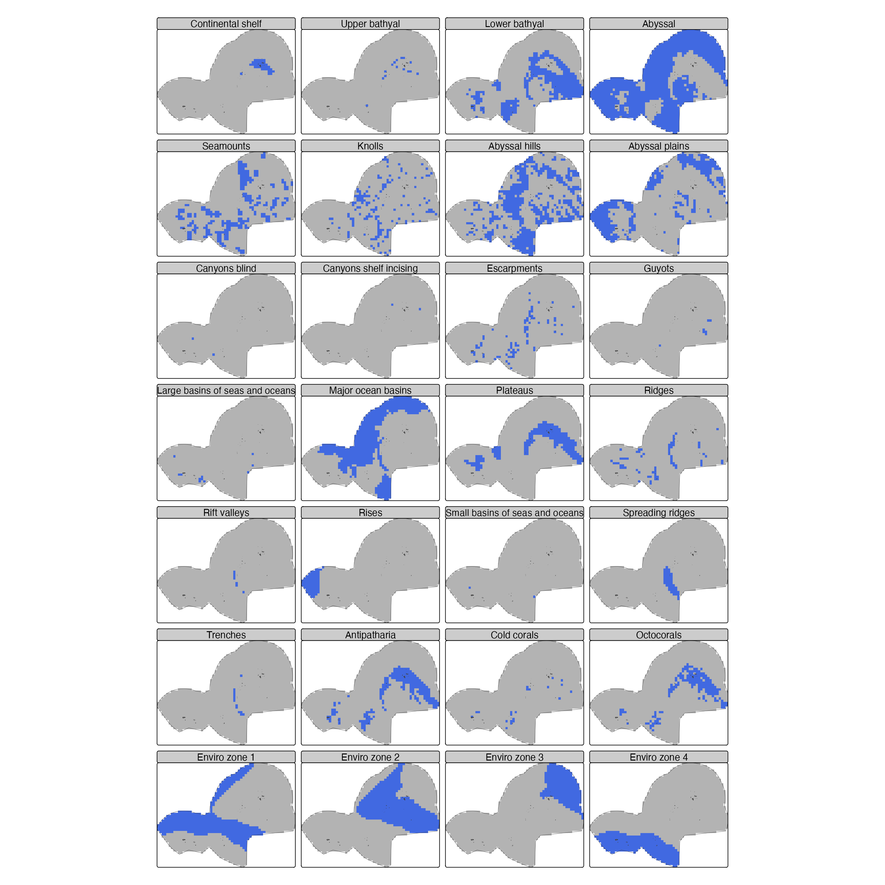
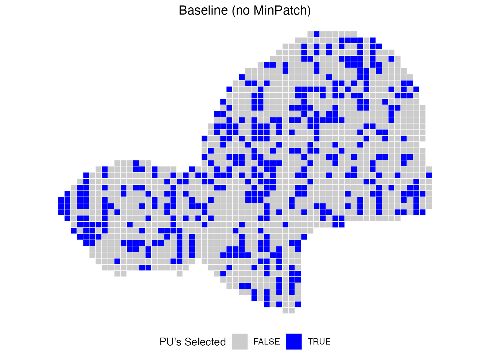
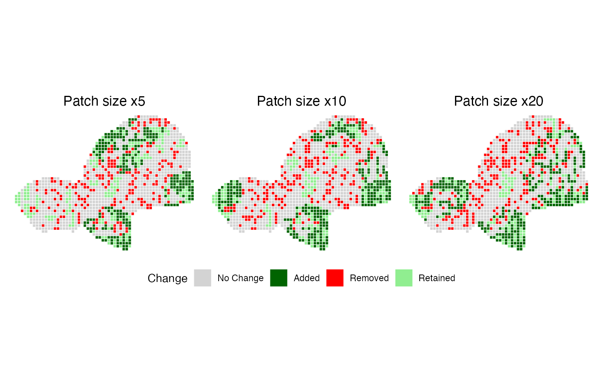
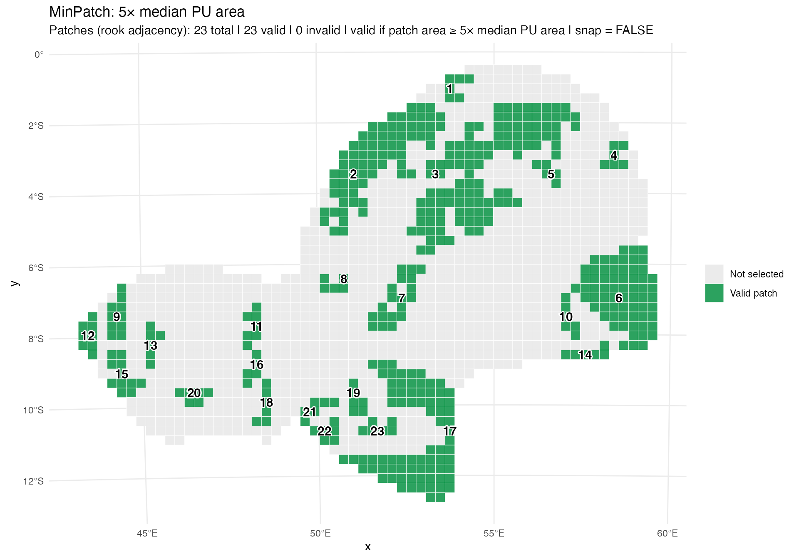
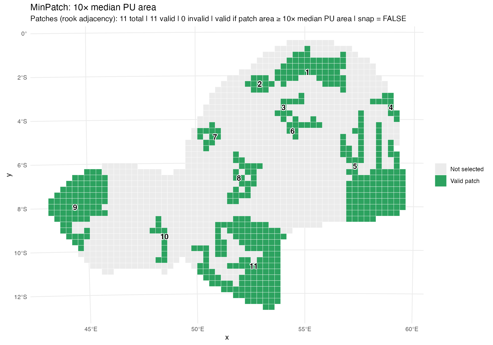
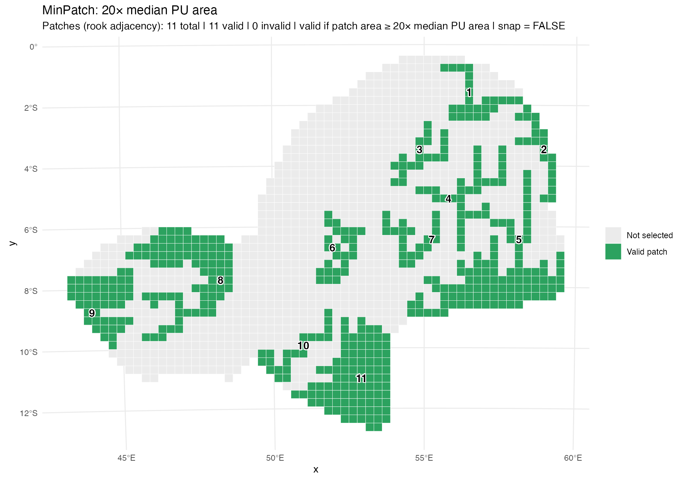
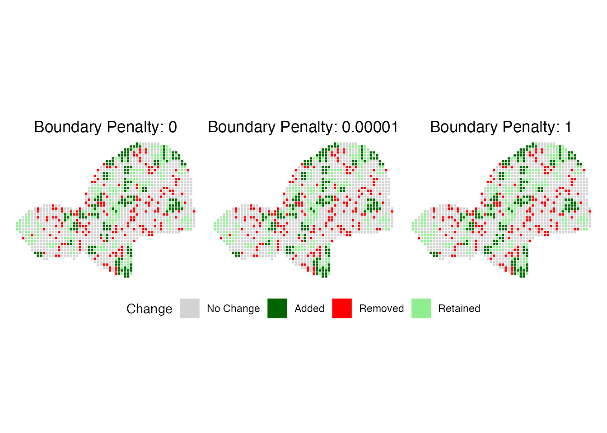
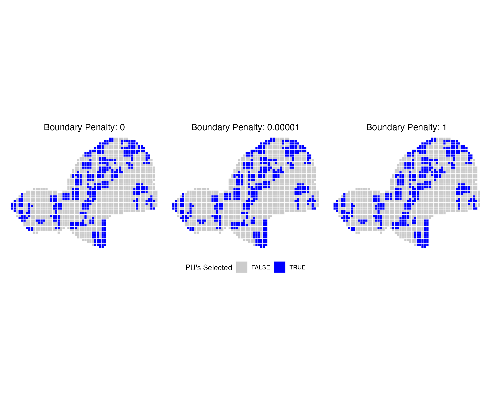

# Using oceandatr and minpatch to reduce fragmentation in a marine planning region (Seychelles)

## 1. Introduction

In many marine spatial planning problems, the goal is not only to meet
representation targets at the lowest possible cost, but also to consider
*how selected areas are arranged in space*. Highly fragmented marine
protected areas can be difficult to manage and enforce, and small
isolated patches may not sustain viable populations. Scattered solutions
can also be difficult to justify to decision-makers and stakeholders.

Two R packages are especially helpful for tackling these issues in a
marine context.

- The `oceandatr` package offers a practical way to build realistic,
  analysis-ready marine planning datasets. It helps users obtain
  planning boundaries (e.g., exclusive economic zones or high-seas
  regions), generate planning-unit grids, and access global ocean
  datasets—including bathymetry, geomorphology, seamounts, and
  environmental conditions—aligned to those grids. Together, these tools
  make it easier to assemble consistent inputs for marine spatial
  planning analyses.

- The `minpatch` package is a post-processing tool that modifies
  conservation planning solutions produced by `prioritizr` to reduce
  fragmentation. It enforces a user-defined minimum patch size by
  removing patches that are too small and adding new areas to maintain
  conservation targets. It then simplifies the solution by removing
  unnecessary planning units, while tracking how these changes affect
  patch structure and total cost.

In this vignette, we demonstrate the use of `oceandatr` and `minpatch`
using a simple marine example from the Seychelles Exclusive Economic
Zone. We first use `oceandatr` to construct a gridded planning problem
with a set of marine features and then solve a standard `prioritizr`
minimum-set problem. We then apply `minpatch` to explore how different
minimum patch sizes and boundary penalties influence the resulting
solutions.

## 2. Study region and planning units with oceandatr

### 2.1 Load packages

``` r


library(oceandatr)
library(terra)
library(sf)
library(dplyr)
library(ggplot2)
library(patchwork)
library(prioritizr)
library(minpatch)
library(purrr)
library(tibble)
library(kableExtra)
set.seed(123)
# Note: oceandatr requires an up-to-date version of curl for data downloads
# install.packages("curl") 
# packageVersion("curl")
```

### 2.2 Seychelles EEZ as the planning region

We start by using
[`get_boundary()`](https://emlab-ucsb.github.io/spatialgridr/reference/get_boundary.html)
from `oceandatr` to obtain the Seychelles Exclusive Economic zone (EEZ).
This defines our marine planning domain.

``` r

Seychelles_eez <- get_boundary(name = "Seychelles")

# plot to check we have Seychelles' EEZ
plot(Seychelles_eez[1], 
     col = "lightgreen", 
     main = "Seychelles EEZ", 
     axes = TRUE)
```


### 2.3 Choose an equal-area projection

We reproject the planning region into an equal-area projection to ensure
that area- and distance-based calculations are meaningful.

``` r

# use sf::st_bbox to get the bounding box coordinates (in lon/lat)
#sf::st_bbox(Seychelles_eez)

# use projectionwizard.org to choose an equal-area projection, then store as a PROJ string
# https://projectionwizard.org 

projection_Seychelles <- "+proj=laea +lon_0=55 +lat_0=-4.5 +datum=WGS84 +units=m +no_defs"

# check CRS if needed
# sf::st_crs(projection_Seychelles) 
```

### 2.4 Create a planning-unit grid

We now create a grid over the EEZ. To keep runtime moderate, we use a
fairly coarse resolution. Our units will be in meters.

``` r

# check which units to use
# sf::st_crs(projection_Seychelles, 
#           parameters = TRUE)$units_gdal

# grid the planning area
Seychelles_grid <- get_grid(
  boundary   = Seychelles_eez,
  resolution = 30000, # 30,000 just to test the code but a finer resolution can be opted with a more powerful PC    
  crs        = projection_Seychelles)

# project the eez into same projection as grid for plotting
Seychelles_eez_proj <- Seychelles_eez %>%
  sf::st_transform(crs = projection_Seychelles) %>%
  sf::st_geometry()

# plot the grid
terra::plot(Seychelles_grid, 
            col = "gold3", 
            axes = FALSE, 
            legend = FALSE,
            main = "Seychelles spatial grid (30 km)")
plot(Seychelles_eez_proj, 
     add = TRUE, 
     border = "black", 
     lwd = 1)
```


Each *cell* of `Seychelles_grid` is a planning unit. To build a
`prioritizr` problem later, it’s useful to have a vector version of the
grid:

``` r

# convert grid to sf polygons as minpatch only works with sf
Seychelles_pu <- Seychelles_grid %>%
  stars::st_as_stars() %>%
  sf::st_as_sf() %>%
  dplyr::mutate(
    id   = dplyr::row_number(),
    cost = as.numeric(sf::st_area(.)) / 1e6  # cost = area in km²
  ) %>%
  dplyr::select(-layer)
```

## 3. Building marine features with oceandatr

We will use a set of features available on `oceandatr`:

- bathymetric depth zones

- geomorphology - seafloor features (banks, ridges, etc.)

- knolls

- seamounts

- coral habitat

- environmental zones - clusters of environmental conditions

### 3.1 Prepare feature stack

These layers can easily be obtained using the `get_features` function.

``` r

# set seed for reproducibility in the get_enviro_zones() sampling to find optimal cluster number
set.seed(500)

feature_set <- get_features(spatial_grid = Seychelles_grid) %>%
  remove_empty_layers()
  
# tidy up feature data names for nicer mapping
names(feature_set) <-  gsub("_", " ", names(feature_set)) %>% stringr::str_to_sentence()
```

### 3.2 Plot features

Features are visualised with **tmap**. Planning units are coloured
**blue** where a feature is present and **grey** where it is absent.

``` r

library(tmap)
library(terra)
library(stringr)

names(feature_set) <- names(feature_set) %>% 
  gsub("_", " ", .) %>% 
  stringr::str_to_sentence()

feature_bin <- feature_set > 0

m <- tm_shape(feature_bin) +
  tm_raster(
    col.scale = tm_scale_categorical(
      values = c("grey70", "royalblue"),
      labels = c("Absent", "Present")
    ),
    col.legend = tm_legend_hide(),   # hide legend for this layer
    col.free = FALSE
  ) +
  tm_facets(ncol = 4) +
  tm_shape(Seychelles_eez) +
  tm_borders() +
  tm_layout(
    panel.label.size = 1.5,
    legend.show = FALSE )

m +
  tm_add_legend(
    type = "fill",
    labels = c("Absent", "Present"),
    col = c("grey70", "royalblue"),
    title = ""
  ) +
  tm_layout(
    legend.outside = TRUE,
    legend.position = c("center", "bottom"),
    legend.text.size = 1
  )
```



### 3.3 Converting features to sf object and combining it with the PU grid

As MinPatch only works well with sf objects, we convert this feature
stack into sf. Afterwards, we put features and the grid as one data
table.

``` r

# features to sf
features <- feature_set %>%
  stars::st_as_stars() %>% # convert data to sf
  sf::st_as_sf() %>%
  dplyr::mutate(id = dplyr::row_number()) %>%
  sf::st_drop_geometry()

# combining 
Seychelles_sf <- Seychelles_pu %>%
  dplyr::left_join(
    as.data.frame(features),
    by = "id"
  )

# store feature column names
feature_set <- names(features) %>%
  dplyr::setdiff("id")
```

## 4. Build and solve a `prioritizr` problem

We now build a simple minimum-set problem using `prioritizr`, with
equal-weight features and a uniform target of 30% for each feature.

``` r

# build the problem using sf planning units + feature columns
p_base <-
  prioritizr::problem(
    x              = Seychelles_sf,
    features       = feature_set,
    cost_column    = "cost"
  ) %>%
  add_min_set_objective() %>%
  add_relative_targets(0.30) %>% # 30% of each feature
  add_binary_decisions() %>%
  add_rsymphony_solver(verbose = FALSE) # change this to cbc later
p_base
```

    #> A conservation problem (<ConservationProblem>)
    #> ├•data
    #> │├•features:    "Continental shelf", "Upper bathyal", "Lower bathyal", "Abyssal", … (28 total)
    #> │└•planning units:
    #> │ ├•data:       <sf> (1500 total)
    #> │ ├•costs:      continuous values (between 900.2126 and 900.2126)
    #> │ ├•extent:     -1301436, -912664.9, 511794.5, 457589 (xmin, ymin, xmax, ymax)
    #> │ └•CRS:        +proj=laea +lat_0=-4.5 +lon_0=55 +x_0=0 +y_0=0 +datum=WGS84 +units=m +no_defs (projected)
    #> ├•formulation
    #> │├•objective:   minimum set objective
    #> │├•penalties:   none specified
    #> │├•features:
    #> ││├•targets:    relative targets (all equal to 0.3)
    #> ││└•weights:    none specified
    #> │├•constraints: none specified
    #> │└•decisions:   binary decision
    #> └•optimization
    #>  ├•portfolio:   default portfolio
    #>  └•solver:      rsymphony solver (`gap` = 0.1, `time_limit` = 2147483647, `first_feasible` = FALSE, …)
    #> # ℹ Use `summary(...)` to see complete formulation.

We then solve this baseline problem without any fragmentation controls
and use it as a reference for the MinPatch experiments.

``` r

# solve the baseline problem
t_base <- system.time({
  s_base <- solve(p_base)
})

# Plot the baseline solution
p_base_plot <- plot_prioritizr(s_base) +
  ggtitle("Baseline (no MinPatch)")

p_base_plot
```



In this baseline solution, we see that the selected planning units are
fragmented and scattered across the planning region.

## 5. Set up MinPatch parameters

We define minimum patch sizes relative to the planning units by scaling
the **median PU area** by `multipliers` (5×, 10×, 20×). This makes the
thresholds easy to interpret as “roughly how many planning units per
patch”. We also set a single **`patch_radius`** for all runs, chosen to
represent a neighbourhood of about 10 planning units. This radius
defines the spatial search distance used by MinPatch to identify
neighbouring planning units when forming, expanding, or merging patches.

``` r

# median planning-unit area (m² and km²)
median_pu_area_m2 <- median(st_area(Seychelles_sf))
median_pu_area_km2 <- median_pu_area_m2 / 1e6

# multipliers relative to the median PU area
multipliers <- c(5, 10, 20)

# minimum patch sizes in m² and km²
patch_sizes_m2  <- multipliers * median_pu_area_m2
patch_sizes_km2 <- patch_sizes_m2 / 1e6

# setting patch radius as the length of 10 PUs
median_pu_length_m <- sqrt(median_pu_area_m2)

# set radius to 10 PU lengths
patch_radius <- 10 * median_pu_length_m

# summary table
minpatch_param_summary <- tibble::tibble(
  multiplier       = multipliers,
  min_patch_m2     = patch_sizes_m2,
  min_patch_km2    = patch_sizes_km2,
  median_pu_m2     = median_pu_area_m2,
  median_pu_area_km2 = median_pu_area_km2)

# summaries of the different values
cat("\nMinPatch parameters (relative to planning units):\n")
#> 
#> MinPatch parameters (relative to planning units):

cat("- Median planning unit area:",
    round(median_pu_area_km2, 3), "km^2\n\n")
#> - Median planning unit area: 900.213 km^2

for (i in seq_along(multipliers)) {
  cat("Multiplier:", multipliers[i], "x median PU area\n")
  cat("  - Minimum patch size:",
      round(patch_sizes_km2[i], 2), "km^2\n")
  cat("  - Corresponds to ≈",
      round(patch_sizes_km2[i] / median_pu_area_km2, 2),
      "planning units\n\n")
}
#> Multiplier: 5 x median PU area
#>   - Minimum patch size: 4501.06 km^2
#>   - Corresponds to ≈ 5 planning units
#> 
#> Multiplier: 10 x median PU area
#>   - Minimum patch size: 9002.13 km^2
#>   - Corresponds to ≈ 10 planning units
#> 
#> Multiplier: 20 x median PU area
#>   - Minimum patch size: 18004.25 km^2
#>   - Corresponds to ≈ 20 planning units

median_pu_length <- sqrt(median_pu_area_m2)      # ~ PU width (m)
radius_in_pus <- patch_radius / median_pu_length # PU-widths

cat("Patch radius used for all runs:\n")
#> Patch radius used for all runs:
cat("  -", round(patch_radius, 0), "m (≈", round(patch_radius/1000, 2), "km)\n")
#>   - 300035 m (≈ 300.04 km)
cat("  - ≈", round(radius_in_pus, 1), "planning units outward (radius)\n")
#>   - ≈ 10 planning units outward (radius)
```

## 6. Run MinPatch for different minimum patch sizes

We now run MinPatch once for each minimum patch factor using the
different multipliers. Each run starts from the same `prioritizr`
solution but applies different constraints on minimum patch size.

``` r

minpatch_results <- vector("list", length(patch_sizes_m2))
minpatch_times <- numeric(length(patch_sizes_m2))

for (i in seq_along(patch_sizes_m2)) {
  
cat("\n============================================\n")
cat("Running MinPatch with min patch area ~",
    round(patch_sizes_km2[i], 2), "km^2 (",
    multipliers[i], "x median PU)\n")
cat("============================================\n")
  
  # time the MinPatch run
  t_mp <- system.time({
     minpatch_results[[i]] <- run_minpatch(
    prioritizr_problem   = p_base,
    prioritizr_solution  = s_base,
    min_patch_size       = patch_sizes_m2[i],
    patch_radius         = patch_radius,
    boundary_penalty     = 0,
    remove_small_patches = TRUE,
    add_patches          = TRUE,
    whittle_patches      = TRUE,
    verbose              = TRUE
  )
    
  })
 
  # store elapsed time (seconds)
  minpatch_times[i] <- t_mp[["elapsed"]]
}
#> 
#> ============================================
#> Running MinPatch with min patch area ~ 4501.06 km^2 ( 5 x median PU)
#> ============================================
#> Validating inputs...
#> Initializing data structures...
#> Calculating boundary matrix using 14 cores...
#> Processing chunks in parallel...
#> Combining results...
#> Creating patch radius dictionary (optimized)...
#> Processed 100 of 1500 planning units
#> Processed 200 of 1500 planning units
#> Processed 300 of 1500 planning units
#> Processed 400 of 1500 planning units
#> Processed 500 of 1500 planning units
#> Processed 600 of 1500 planning units
#> Processed 700 of 1500 planning units
#> Processed 800 of 1500 planning units
#> Processed 900 of 1500 planning units
#> Processed 1000 of 1500 planning units
#> Processed 1100 of 1500 planning units
#> Processed 1200 of 1500 planning units
#> Processed 1300 of 1500 planning units
#> Processed 1400 of 1500 planning units
#> Processed 1500 of 1500 planning units
#> Calculating initial patch statistics...
#> Stage 1: Removing small patches...
#> Stage 2: Adding new patches...
#>   Initial unmet targets: 22 
#>   Unmet feature IDs: 1, 3, 4, 5, 6, 7, 8, 9, 11, 12, 14, 15, 16, 19, 20, 22, 23, 24, 25, 26, 27, 28 
#>   Iteration 1 - Unmet targets: 22 
#>     Found 1268 potential patches with scores
#>     Best score: 0.0001156402 for unit 1035 
#>     Added patch centered on unit 1035 
#>   Iteration 2 - Unmet targets: 18 
#>     Found 1188 potential patches with scores
#>     Best score: 0.00009560689 for unit 1467 
#>     Added patch centered on unit 1467 
#>   Iteration 3 - Unmet targets: 8 
#>     Found 1043 potential patches with scores
#>     Best score: 0.00005491464 for unit 2 
#>     Added patch centered on unit 2 
#>   Iteration 4 - Unmet targets: 2 
#>     Found 910 potential patches with scores
#>     Best score: 0.00001454845 for unit 192 
#>     Added patch centered on unit 192 
#>   All conservation targets are now met!
#> Stage 3: Removing unnecessary planning units...
#>     Edge units found: 178 
#>     Keystone units: 0 
#>     New keystone units: 12 
#>     Scoreable units: 166 
#>     Removed unit 418 at iteration 1 
#>     Edge units found: 167 
#>     Keystone units: 12 
#>     New keystone units: 0 
#>     Scoreable units: 167 
#>     Removed unit 383 at iteration 2 
#>     Edge units found: 169 
#>     Keystone units: 12 
#>     New keystone units: 0 
#>     Scoreable units: 169 
#>     Removed unit 419 at iteration 3 
#>     Edge units found: 169 
#>     Keystone units: 12 
#>     New keystone units: 0 
#>     Scoreable units: 169 
#>     Removed unit 420 at iteration 4 
#>     Edge units found: 170 
#>     Keystone units: 12 
#>     New keystone units: 0 
#>     Scoreable units: 170 
#>     Removed unit 385 at iteration 5 
#>     Removed unit 350 at iteration 6 
#>     Unit 349 cannot be removed - adding to keystone set
#>     Removed unit 351 at iteration 8 
#>     Removed unit 317 at iteration 9 
#>     Removed unit 283 at iteration 10 
#>   Whittling iteration 100 
#>   Whittling iteration 200 
#>   Whittling iteration 300 
#>   No units can be removed - all are keystone - terminating
#> Calculating final statistics...
#> MinPatch processing complete!
#> 
#> ============================================
#> Running MinPatch with min patch area ~ 9002.13 km^2 ( 10 x median PU)
#> ============================================
#> Validating inputs...
#> Initializing data structures...
#> Calculating boundary matrix using 14 cores...
#> Processing chunks in parallel...
#> Combining results...
#> Creating patch radius dictionary (optimized)...
#> Processed 100 of 1500 planning units
#> Processed 200 of 1500 planning units
#> Processed 300 of 1500 planning units
#> Processed 400 of 1500 planning units
#> Processed 500 of 1500 planning units
#> Processed 600 of 1500 planning units
#> Processed 700 of 1500 planning units
#> Processed 800 of 1500 planning units
#> Processed 900 of 1500 planning units
#> Processed 1000 of 1500 planning units
#> Processed 1100 of 1500 planning units
#> Processed 1200 of 1500 planning units
#> Processed 1300 of 1500 planning units
#> Processed 1400 of 1500 planning units
#> Processed 1500 of 1500 planning units
#> Calculating initial patch statistics...
#> Stage 1: Removing small patches...
#> Stage 2: Adding new patches...
#>   Initial unmet targets: 24 
#>   Unmet feature IDs: 1, 3, 4, 5, 6, 7, 8, 9, 11, 12, 13, 14, 15, 16, 18, 19, 20, 22, 23, 24, 25, 26, 27, 28 
#>   Iteration 1 - Unmet targets: 24 
#>     Found 1369 potential patches with scores
#>     Best score: 0.00009068137 for unit 1456 
#>     Added patch centered on unit 1456 
#>   Iteration 2 - Unmet targets: 16 
#>     Found 1188 potential patches with scores
#>     Best score: 0.00008346697 for unit 1035 
#>     Added patch centered on unit 1035 
#>   Iteration 3 - Unmet targets: 8 
#>     Found 1102 potential patches with scores
#>     Best score: 0.00005543891 for unit 916 
#>     Added patch centered on unit 916 
#>   Iteration 4 - Unmet targets: 6 
#>     Found 1025 potential patches with scores
#>     Best score: 0.00004289114 for unit 1 
#>     Added patch centered on unit 1 
#>   Iteration 5 - Unmet targets: 1 
#>     Found 480 potential patches with scores
#>     Best score: 0.0000104797 for unit 484 
#>     Added patch centered on unit 484 
#>   All conservation targets are now met!
#> Stage 3: Removing unnecessary planning units...
#>     Edge units found: 151 
#>     Keystone units: 0 
#>     New keystone units: 1 
#>     Scoreable units: 150 
#>     Removed unit 172 at iteration 1 
#>     Edge units found: 151 
#>     Keystone units: 1 
#>     New keystone units: 0 
#>     Scoreable units: 151 
#>     Removed unit 143 at iteration 2 
#>     Edge units found: 153 
#>     Keystone units: 1 
#>     New keystone units: 0 
#>     Scoreable units: 153 
#>     Removed unit 142 at iteration 3 
#>     Edge units found: 154 
#>     Keystone units: 1 
#>     New keystone units: 0 
#>     Scoreable units: 154 
#>     Removed unit 115 at iteration 4 
#>     Edge units found: 155 
#>     Keystone units: 1 
#>     New keystone units: 0 
#>     Scoreable units: 155 
#>     Removed unit 114 at iteration 5 
#>     Removed unit 171 at iteration 6 
#>     Removed unit 173 at iteration 7 
#>     Removed unit 181 at iteration 8 
#>     Removed unit 182 at iteration 9 
#>     Removed unit 183 at iteration 10 
#>   Whittling iteration 100 
#>   Whittling iteration 200 
#>   No units can be removed - all are keystone - terminating
#> Calculating final statistics...
#> MinPatch processing complete!
#> 
#> ============================================
#> Running MinPatch with min patch area ~ 18004.25 km^2 ( 20 x median PU)
#> ============================================
#> Validating inputs...
#> Initializing data structures...
#> Calculating boundary matrix using 14 cores...
#> Processing chunks in parallel...
#> Combining results...
#> Creating patch radius dictionary (optimized)...
#> Processed 100 of 1500 planning units
#> Processed 200 of 1500 planning units
#> Processed 300 of 1500 planning units
#> Processed 400 of 1500 planning units
#> Processed 500 of 1500 planning units
#> Processed 600 of 1500 planning units
#> Processed 700 of 1500 planning units
#> Processed 800 of 1500 planning units
#> Processed 900 of 1500 planning units
#> Processed 1000 of 1500 planning units
#> Processed 1100 of 1500 planning units
#> Processed 1200 of 1500 planning units
#> Processed 1300 of 1500 planning units
#> Processed 1400 of 1500 planning units
#> Processed 1500 of 1500 planning units
#> Calculating initial patch statistics...
#> Stage 1: Removing small patches...
#> Stage 2: Adding new patches...
#>   Initial unmet targets: 26 
#>   Unmet feature IDs: 1, 2, 3, 4, 5, 6, 7, 8, 9, 10, 11, 12, 13, 14, 15, 16, 18, 19, 20, 22, 23, 24, 25, 26, 27, 28 
#>   Iteration 1 - Unmet targets: 26 
#>     Found 1433 potential patches with scores
#>     Best score: 0.00008005606 for unit 1467 
#>     Added patch centered on unit 1467 
#>   Iteration 2 - Unmet targets: 21 
#>     Found 1266 potential patches with scores
#>     Best score: 0.00006988945 for unit 684 
#>     Added patch centered on unit 684 
#>   Iteration 3 - Unmet targets: 11 
#>     Found 1103 potential patches with scores
#>     Best score: 0.00005433364 for unit 916 
#>     Added patch centered on unit 916 
#>   Iteration 4 - Unmet targets: 8 
#>     Found 1026 potential patches with scores
#>     Best score: 0.00004598478 for unit 965 
#>     Added patch centered on unit 965 
#>   Iteration 5 - Unmet targets: 3 
#>     Found 906 potential patches with scores
#>     Best score: 0.00001719904 for unit 749 
#>     Added patch centered on unit 749 
#>   All conservation targets are now met!
#> Stage 3: Removing unnecessary planning units...
#>     Edge units found: 105 
#>     Keystone units: 0 
#>     New keystone units: 3 
#>     Scoreable units: 102 
#>     Removed unit 171 at iteration 1 
#>     Edge units found: 102 
#>     Keystone units: 3 
#>     New keystone units: 0 
#>     Scoreable units: 102 
#>     Removed unit 172 at iteration 2 
#>     Edge units found: 103 
#>     Keystone units: 3 
#>     New keystone units: 0 
#>     Scoreable units: 103 
#>     Removed unit 173 at iteration 3 
#>     Edge units found: 104 
#>     Keystone units: 3 
#>     New keystone units: 0 
#>     Scoreable units: 104 
#>     Removed unit 174 at iteration 4 
#>     Edge units found: 106 
#>     Keystone units: 3 
#>     New keystone units: 0 
#>     Scoreable units: 106 
#>     Removed unit 175 at iteration 5 
#>     Removed unit 176 at iteration 6 
#>     Removed unit 177 at iteration 7 
#>     Removed unit 178 at iteration 8 
#>     Removed unit 149 at iteration 9 
#>     Removed unit 150 at iteration 10 
#>   Whittling iteration 100 
#>   Whittling iteration 200 
#>   Whittling iteration 300 
#>   Whittling iteration 400 
#>   Whittling iteration 500 
#>   No units can be removed - all are keystone - terminating
#> Calculating final statistics...
#> MinPatch processing complete!

# name the outputs
names(minpatch_results) <- paste0("minpatch_", multipliers, "x")
names(minpatch_times)   <- paste0("minpatch_", multipliers, "x")
```

## 7. Interpreting MinPatch outcomes

In this section, we interpret how MinPatch modifies the baseline
solution. We compare resulting spatial patterns, patch structure, and
trade-offs between fragmentation and cost.

#### 7.1 Selected planning units (baseline vs MinPatch runs)

We start by showing the selected planning units for the baseline and
each MinPatch run.

``` r

# plot_solution_grid(
#   results = minpatch_results,
#   get_solution_fun = get_solution_with_solution1,
#   subtitle_values = multipliers,
#   title_prefix = "MinPatch: ",
#   value_label_fun = function(x) paste0(x, "× median PU area"),
#   include_baseline = TRUE,
#   baseline_solution = s_base,
#   baseline_title = "Baseline (prioritizr)",
#   ncol = 2
# )
```

On the plot, we can see that the baseline solution is highly fragmented,
with many small and isolated selected planning units. As the minimum
patch size increases, these small patches are removed or merged, leading
to fewer, larger, and more spatially coherent patches.

#### 7.2 Group summary table (all runs)

Having examined the spatial solutions, we summarise all runs in a single
table to compare outcomes across different metrics.

[TABLE]

The baseline solution is highly fragmented (129 patches), with most
patches failing the minimum-size rule (only 21 valid). Once MinPatch is
applied, patches consolidate sharply: patch counts drop from 28 (×5) to
15 (×10) to 8 (×20), and all remaining patches are valid at every
multiplier. As the multiplier increases, patch sizes rise well beyond
the threshold, showing progressively stronger spatial consolidation into
fewer, larger patches.

#### 7.3 Change maps (Added / Removed / Retained / No change)

After comparing runs, we use `plot_minpatch` to map which planning units
were added, removed, or kept versus the baseline. The maps show how
MinPatch reshapes the solution to meet minimum patch sizes and cut
fragmentation.

``` r

# Create plots for each minpatch run and arrange them with patchwork
plot_list <- purrr::map2(
  minpatch_results,
  multipliers,
  ~ plot_minpatch(
      .x,
      title = paste0("Patch size x", .y)
    )
)
patchwork::wrap_plots(
  plotlist = plot_list,
  guides   = "collect",
  ncol     = 3
) &
  theme(legend.position = "bottom")
```



#### 7.4 Patch-labelled maps

We use a function that labels patches in the MinPatch solutions and
flags each one as valid (meets the minimum patch-size rule) or invalid
(below the threshold; if they exist). This makes the patch definition
explicit and helps interpret the patch counts in the summary table.

Patch counts depend on how “connected” is defined. MinPatch uses
**rook** **adjacency**, where planning units must share an edge to be in
the same patch. By contrast, queen adjacency also treats corner-touching
(diagonal) units as connected. For ecology and management,
rook-connected patches are often more defensible because they represent
truly contiguous area, avoid corner-only links, and tend to form more
compact patch units.

``` r


for (m in c(5, 10, 20)) {
  print(minpatch::plot_patch_validity(
    multiplier = m,
    multipliers = multipliers,
    minpatch_results = minpatch_results,
    pu_sf = Seychelles_sf,
    do_snap = FALSE
  ))
}
#> MinPatch 5x: 23 patches | 23 valid | 0 invalid (threshold = 4501.063 km²) | snap = FALSE
```



    #> MinPatch 10x: 11 patches | 11 valid | 0 invalid (threshold = 9002.126 km²) | snap = FALSE



    #> MinPatch 20x: 11 patches | 11 valid | 0 invalid (threshold = 18004.25 km²) | snap = FALSE



#### 7.5 Individual summaries (per run)

Here, we show all the individual summaries for all the runs. These
provide a detailed breakdown and comparison of the metrics of each
minimum patch run with the baseline solution, as well as other
information such as feature level area comparison and feature change
summaries.

``` r

for (i in seq_along(minpatch_results)) {

  result <- minpatch_results[[i]]
  factor_val <- multipliers[i]

  cat("\n\n## Scenario: MinPatch with min patch size = ",
      factor_val, " × median PU area\n\n", sep = "")

  # MinPatch summary (if it prints text)
  cat("**MinPatch processing summary**\n\n")
  print_minpatch_summary(result)

  comparison <- compare_solutions(result)

  cat("\n**Overall solution comparison**\n\n")
print(comparison$overall)

  cat("\n**Feature-level area comparison**\n\n")
print(comparison$features)

  cat("\n**Feature change summary**\n\n")
print(comparison$summary)
}
#> 
#> 
#> ## Scenario: MinPatch with min patch size = 5 × median PU area
#> 
#> **MinPatch processing summary**
#> 
#> === MinPatch Processing Summary ===
#> 
#> Patch Statistics:
#>   Initial patches: 146 (valid: 22)
#>   Final patches: 23 (valid: 23)
#>   Area change: 2700637750.93 (0.7%)
#> 
#> Cost Breakdown:
#>   Planning unit cost: 410496.94
#>   Boundary cost: 0.00
#>   Total cost: 410496.94
#>   Selected units: 456
#> 
#> Feature Representation:
#>   Total features: 28
#>   Targets met: 28
#>   Targets unmet: 0
#>   Mean proportion: 0.376
#>   Total shortfall: 0.00
#> 
#> 
#> === End Summary ===
#> 
#> **Overall solution comparison**
#> 
#>                        Metric       Original       MinPatch     Change
#> 1     Selected Planning Units          453.0          456.0          3
#> 2                  Total Area 407796300391.2 410496938142.2 2700637751
#> 3           Number of Patches          146.0           23.0       -123
#> 4 Valid Patches (>= min size)           22.0           23.0          1
#> 5           Median Patch Size   1800425167.3   5401275501.9 3600850335
#> 6          Planning Unit Cost       410496.9       410496.9          0
#> 7               Boundary Cost            0.0            0.0          0
#> 8                  Total Cost       410496.9       410496.9          0
#>   Percent_Change
#> 1      0.6622517
#> 2      0.6622517
#> 3    -84.2465753
#> 4      4.5454545
#> 5    200.0000000
#> 6      0.0000000
#> 7             NA
#> 8      0.0000000
#> 
#> **Feature-level area comparison**
#> 
#>    Feature_ID Target Original_Area MinPatch_Area Area_Change Percent_Change
#> 1           1   11.1            12            12           0      0.0000000
#> 2           2    4.5             5             7           2     40.0000000
#> 3           3  110.1           111           112           1      0.9009009
#> 4           4  324.3           325           325           0      0.0000000
#> 5           5   86.1            93            87          -6     -6.4516129
#> 6           6   45.9            46            59          13     28.2608696
#> 7           7  163.2           175           178           3      1.7142857
#> 8           8  116.1           125           123          -2     -1.6000000
#> 9           9    0.6             1             1           0      0.0000000
#> 10         10    0.6             1             1           0      0.0000000
#> 11         11   23.1            30            28          -2     -6.6666667
#> 12         12    2.1             4             3          -1    -25.0000000
#> 13         13    3.3             5             4          -1    -20.0000000
#> 14         14  158.7           179           171          -8     -4.4692737
#> 15         15   64.5            67            80          13     19.4029851
#> 16         16   20.7            25            22          -3    -12.0000000
#> 17         17    2.1             3             3           0      0.0000000
#> 18         18   22.5            42            34          -8    -19.0476190
#> 19         19    0.6             1             1           0      0.0000000
#> 20         20   14.4            19            17          -2    -10.5263158
#> 21         21    3.9             6             6           0      0.0000000
#> 22         22   63.9            75            91          16     21.3333333
#> 23         23    6.3             7             8           1     14.2857143
#> 24         24   51.3            53            67          14     26.4150943
#> 25         25  137.7           138           139           1      0.7246377
#> 26         26  150.0           152           150          -2     -1.3157895
#> 27         27   74.4            75            75           0      0.0000000
#> 28         28   87.9            88            92           4      4.5454545
#>    Original_Target_Met MinPatch_Target_Met Original_Proportion
#> 1                 TRUE                TRUE            1.081081
#> 2                 TRUE                TRUE            1.111111
#> 3                 TRUE                TRUE            1.008174
#> 4                 TRUE                TRUE            1.002158
#> 5                 TRUE                TRUE            1.080139
#> 6                 TRUE                TRUE            1.002179
#> 7                 TRUE                TRUE            1.072304
#> 8                 TRUE                TRUE            1.076658
#> 9                 TRUE                TRUE            1.666667
#> 10                TRUE                TRUE            1.666667
#> 11                TRUE                TRUE            1.298701
#> 12                TRUE                TRUE            1.904762
#> 13                TRUE                TRUE            1.515152
#> 14                TRUE                TRUE            1.127914
#> 15                TRUE                TRUE            1.038760
#> 16                TRUE                TRUE            1.207729
#> 17                TRUE                TRUE            1.428571
#> 18                TRUE                TRUE            1.866667
#> 19                TRUE                TRUE            1.666667
#> 20                TRUE                TRUE            1.319444
#> 21                TRUE                TRUE            1.538462
#> 22                TRUE                TRUE            1.173709
#> 23                TRUE                TRUE            1.111111
#> 24                TRUE                TRUE            1.033138
#> 25                TRUE                TRUE            1.002179
#> 26                TRUE                TRUE            1.013333
#> 27                TRUE                TRUE            1.008065
#> 28                TRUE                TRUE            1.001138
#>    MinPatch_Proportion
#> 1             1.081081
#> 2             1.555556
#> 3             1.017257
#> 4             1.002158
#> 5             1.010453
#> 6             1.285403
#> 7             1.090686
#> 8             1.059432
#> 9             1.666667
#> 10            1.666667
#> 11            1.212121
#> 12            1.428571
#> 13            1.212121
#> 14            1.077505
#> 15            1.240310
#> 16            1.062802
#> 17            1.428571
#> 18            1.511111
#> 19            1.666667
#> 20            1.180556
#> 21            1.538462
#> 22            1.424100
#> 23            1.269841
#> 24            1.306043
#> 25            1.009441
#> 26            1.000000
#> 27            1.008065
#> 28            1.046644
#> 
#> **Feature change summary**
#> 
#>   features_improved features_reduced features_unchanged targets_gained
#> 1                10               10                  8              0
#>   targets_lost
#> 1            0
#> 
#> 
#> ## Scenario: MinPatch with min patch size = 10 × median PU area
#> 
#> **MinPatch processing summary**
#> 
#> === MinPatch Processing Summary ===
#> 
#> Patch Statistics:
#>   Initial patches: 146 (valid: 8)
#>   Final patches: 11 (valid: 11)
#>   Area change: 11702763587.39 (2.9%)
#> 
#> Cost Breakdown:
#>   Planning unit cost: 419499.06
#>   Boundary cost: 0.00
#>   Total cost: 419499.06
#>   Selected units: 466
#> 
#> Feature Representation:
#>   Total features: 28
#>   Targets met: 28
#>   Targets unmet: 0
#>   Mean proportion: 0.439
#>   Total shortfall: 0.00
#> 
#> 
#> === End Summary ===
#> 
#> **Overall solution comparison**
#> 
#>                        Metric       Original       MinPatch      Change
#> 1     Selected Planning Units          453.0          466.0          13
#> 2                  Total Area 407796300391.2 419499063978.6 11702763587
#> 3           Number of Patches          146.0           11.0        -135
#> 4 Valid Patches (>= min size)            8.0           11.0           3
#> 5           Median Patch Size   1800425167.3   9902338420.1  8101913253
#> 6          Planning Unit Cost       419499.1       419499.1           0
#> 7               Boundary Cost            0.0            0.0           0
#> 8                  Total Cost       419499.1       419499.1           0
#>   Percent_Change
#> 1       2.869757
#> 2       2.869757
#> 3     -92.465753
#> 4      37.500000
#> 5     450.000000
#> 6       0.000000
#> 7             NA
#> 8       0.000000
#> 
#> **Feature-level area comparison**
#> 
#>    Feature_ID Target Original_Area MinPatch_Area Area_Change Percent_Change
#> 1           1   11.1            12            12           0      0.0000000
#> 2           2    4.5             5             6           1     20.0000000
#> 3           3  110.1           111           123          12     10.8108108
#> 4           4  324.3           325           325           0      0.0000000
#> 5           5   86.1            93            87          -6     -6.4516129
#> 6           6   45.9            46            49           3      6.5217391
#> 7           7  163.2           175           169          -6     -3.4285714
#> 8           8  116.1           125           146          21     16.8000000
#> 9           9    0.6             1             1           0      0.0000000
#> 10         10    0.6             1             2           1    100.0000000
#> 11         11   23.1            30            24          -6    -20.0000000
#> 12         12    2.1             4             5           1     25.0000000
#> 13         13    3.3             5             5           0      0.0000000
#> 14         14  158.7           179           160         -19    -10.6145251
#> 15         15   64.5            67            70           3      4.4776119
#> 16         16   20.7            25            21          -4    -16.0000000
#> 17         17    2.1             3             4           1     33.3333333
#> 18         18   22.5            42            66          24     57.1428571
#> 19         19    0.6             1             1           0      0.0000000
#> 20         20   14.4            19            23           4     21.0526316
#> 21         21    3.9             6             9           3     50.0000000
#> 22         22   63.9            75            84           9     12.0000000
#> 23         23    6.3             7            12           5     71.4285714
#> 24         24   51.3            53            62           9     16.9811321
#> 25         25  137.7           138           139           1      0.7246377
#> 26         26  150.0           152           150          -2     -1.3157895
#> 27         27   74.4            75            75           0      0.0000000
#> 28         28   87.9            88           102          14     15.9090909
#>    Original_Target_Met MinPatch_Target_Met Original_Proportion
#> 1                 TRUE                TRUE            1.081081
#> 2                 TRUE                TRUE            1.111111
#> 3                 TRUE                TRUE            1.008174
#> 4                 TRUE                TRUE            1.002158
#> 5                 TRUE                TRUE            1.080139
#> 6                 TRUE                TRUE            1.002179
#> 7                 TRUE                TRUE            1.072304
#> 8                 TRUE                TRUE            1.076658
#> 9                 TRUE                TRUE            1.666667
#> 10                TRUE                TRUE            1.666667
#> 11                TRUE                TRUE            1.298701
#> 12                TRUE                TRUE            1.904762
#> 13                TRUE                TRUE            1.515152
#> 14                TRUE                TRUE            1.127914
#> 15                TRUE                TRUE            1.038760
#> 16                TRUE                TRUE            1.207729
#> 17                TRUE                TRUE            1.428571
#> 18                TRUE                TRUE            1.866667
#> 19                TRUE                TRUE            1.666667
#> 20                TRUE                TRUE            1.319444
#> 21                TRUE                TRUE            1.538462
#> 22                TRUE                TRUE            1.173709
#> 23                TRUE                TRUE            1.111111
#> 24                TRUE                TRUE            1.033138
#> 25                TRUE                TRUE            1.002179
#> 26                TRUE                TRUE            1.013333
#> 27                TRUE                TRUE            1.008065
#> 28                TRUE                TRUE            1.001138
#>    MinPatch_Proportion
#> 1             1.081081
#> 2             1.333333
#> 3             1.117166
#> 4             1.002158
#> 5             1.010453
#> 6             1.067538
#> 7             1.035539
#> 8             1.257537
#> 9             1.666667
#> 10            3.333333
#> 11            1.038961
#> 12            2.380952
#> 13            1.515152
#> 14            1.008192
#> 15            1.085271
#> 16            1.014493
#> 17            1.904762
#> 18            2.933333
#> 19            1.666667
#> 20            1.597222
#> 21            2.307692
#> 22            1.314554
#> 23            1.904762
#> 24            1.208577
#> 25            1.009441
#> 26            1.000000
#> 27            1.008065
#> 28            1.160410
#> 
#> **Feature change summary**
#> 
#>   features_improved features_reduced features_unchanged targets_gained
#> 1                16                6                  6              0
#>   targets_lost
#> 1            0
#> 
#> 
#> ## Scenario: MinPatch with min patch size = 20 × median PU area
#> 
#> **MinPatch processing summary**
#> 
#> === MinPatch Processing Summary ===
#> 
#> Patch Statistics:
#>   Initial patches: 146 (valid: 3)
#>   Final patches: 11 (valid: 11)
#>   Area change: 34208078178.51 (8.4%)
#> 
#> Cost Breakdown:
#>   Planning unit cost: 442004.38
#>   Boundary cost: 0.00
#>   Total cost: 442004.38
#>   Selected units: 491
#> 
#> Feature Representation:
#>   Total features: 28
#>   Targets met: 28
#>   Targets unmet: 0
#>   Mean proportion: 0.465
#>   Total shortfall: 0.00
#> 
#> 
#> === End Summary ===
#> 
#> **Overall solution comparison**
#> 
#>                        Metric       Original       MinPatch      Change
#> 1     Selected Planning Units          453.0          491.0          38
#> 2                  Total Area 407796300391.2 442004378569.8 34208078179
#> 3           Number of Patches          146.0           11.0        -135
#> 4 Valid Patches (>= min size)            3.0           11.0           8
#> 5           Median Patch Size   1800425167.3  22505314591.1 20704889424
#> 6          Planning Unit Cost       442004.4       442004.4           0
#> 7               Boundary Cost            0.0            0.0           0
#> 8                  Total Cost       442004.4       442004.4           0
#>   Percent_Change
#> 1       8.388521
#> 2       8.388521
#> 3     -92.465753
#> 4     266.666667
#> 5    1150.000000
#> 6       0.000000
#> 7             NA
#> 8       0.000000
#> 
#> **Feature-level area comparison**
#> 
#>    Feature_ID Target Original_Area MinPatch_Area Area_Change Percent_Change
#> 1           1   11.1            12            14           2      16.666667
#> 2           2    4.5             5             9           4      80.000000
#> 3           3  110.1           111           143          32      28.828829
#> 4           4  324.3           325           325           0       0.000000
#> 5           5   86.1            93            98           5       5.376344
#> 6           6   45.9            46            66          20      43.478261
#> 7           7  163.2           175           181           6       3.428571
#> 8           8  116.1           125           133           8       6.400000
#> 9           9    0.6             1             1           0       0.000000
#> 10         10    0.6             1             2           1     100.000000
#> 11         11   23.1            30            29          -1      -3.333333
#> 12         12    2.1             4             6           2      50.000000
#> 13         13    3.3             5             5           0       0.000000
#> 14         14  158.7           179           160         -19     -10.614525
#> 15         15   64.5            67            82          15      22.388060
#> 16         16   20.7            25            29           4      16.000000
#> 17         17    2.1             3             3           0       0.000000
#> 18         18   22.5            42            47           5      11.904762
#> 19         19    0.6             1             2           1     100.000000
#> 20         20   14.4            19            17          -2     -10.526316
#> 21         21    3.9             6             5          -1     -16.666667
#> 22         22   63.9            75            95          20      26.666667
#> 23         23    6.3             7            12           5      71.428571
#> 24         24   51.3            53            80          27      50.943396
#> 25         25  137.7           138           152          14      10.144928
#> 26         26  150.0           152           150          -2      -1.315789
#> 27         27   74.4            75            76           1       1.333333
#> 28         28   87.9            88           113          25      28.409091
#>    Original_Target_Met MinPatch_Target_Met Original_Proportion
#> 1                 TRUE                TRUE            1.081081
#> 2                 TRUE                TRUE            1.111111
#> 3                 TRUE                TRUE            1.008174
#> 4                 TRUE                TRUE            1.002158
#> 5                 TRUE                TRUE            1.080139
#> 6                 TRUE                TRUE            1.002179
#> 7                 TRUE                TRUE            1.072304
#> 8                 TRUE                TRUE            1.076658
#> 9                 TRUE                TRUE            1.666667
#> 10                TRUE                TRUE            1.666667
#> 11                TRUE                TRUE            1.298701
#> 12                TRUE                TRUE            1.904762
#> 13                TRUE                TRUE            1.515152
#> 14                TRUE                TRUE            1.127914
#> 15                TRUE                TRUE            1.038760
#> 16                TRUE                TRUE            1.207729
#> 17                TRUE                TRUE            1.428571
#> 18                TRUE                TRUE            1.866667
#> 19                TRUE                TRUE            1.666667
#> 20                TRUE                TRUE            1.319444
#> 21                TRUE                TRUE            1.538462
#> 22                TRUE                TRUE            1.173709
#> 23                TRUE                TRUE            1.111111
#> 24                TRUE                TRUE            1.033138
#> 25                TRUE                TRUE            1.002179
#> 26                TRUE                TRUE            1.013333
#> 27                TRUE                TRUE            1.008065
#> 28                TRUE                TRUE            1.001138
#>    MinPatch_Proportion
#> 1             1.261261
#> 2             2.000000
#> 3             1.298819
#> 4             1.002158
#> 5             1.138211
#> 6             1.437908
#> 7             1.109069
#> 8             1.145564
#> 9             1.666667
#> 10            3.333333
#> 11            1.255411
#> 12            2.857143
#> 13            1.515152
#> 14            1.008192
#> 15            1.271318
#> 16            1.400966
#> 17            1.428571
#> 18            2.088889
#> 19            3.333333
#> 20            1.180556
#> 21            1.282051
#> 22            1.486698
#> 23            1.904762
#> 24            1.559454
#> 25            1.103849
#> 26            1.000000
#> 27            1.021505
#> 28            1.285552
#> 
#> **Feature change summary**
#> 
#>   features_improved features_reduced features_unchanged targets_gained
#> 1                19                5                  4              0
#>   targets_lost
#> 1            0
```

**Notes:**

- The calculation for valid and invalid patches should then again be
  rechecked.

- How is the planning unit cost calculated for the baseline? And why
  does it differ in every summary table (i.e., table for each
  multiplier)?

- Add units to Total Area (km2 or m2?)

## 8. Run different boundary penalties

The boundary penalty controls how strongly MinPatch favours spatially
compact patches during the whittling stage. At this step, MinPatch
attempts to remove planning units from the edges of patches while
maintaining conservation targets. Whether a unit can be removed depends
on the trade-off between its planning-unit cost and the change in
boundary cost that would result from its removal.

The boundary penalty scales this trade-off by assigning a cost to
fragmentation: higher values discourage the creation of additional patch
edges and therefore promote more compact solutions. In the Seychelles
example, we explore a small range of boundary penalties to illustrate
how sensitive the whittling process is to boundary costs under a marine
grid with relatively uniform planning-unit areas.

``` r

# calculate reasonable parameters based on planning unit characteristics
median_area <- median(st_area(Seychelles_sf)) 
min_patch_size <- median_area * 5
patch_radius <- sqrt(median_area * 10/pi)

bp3 = 0
t3 <- system.time({
 result3 <- run_minpatch(
  prioritizr_problem = p_base,
  prioritizr_solution = s_base,
  min_patch_size = min_patch_size,
  patch_radius = patch_radius,
  boundary_penalty = bp3,
  remove_small_patches = TRUE,
  add_patches = TRUE,
  whittle_patches = TRUE,
  verbose = TRUE
) 
})
#> Validating inputs...
#> Initializing data structures...
#> Calculating boundary matrix using 14 cores...
#> Processing chunks in parallel...
#> Combining results...
#> Creating patch radius dictionary (optimized)...
#> Processed 100 of 1500 planning units
#> Processed 200 of 1500 planning units
#> Processed 300 of 1500 planning units
#> Processed 400 of 1500 planning units
#> Processed 500 of 1500 planning units
#> Processed 600 of 1500 planning units
#> Processed 700 of 1500 planning units
#> Processed 800 of 1500 planning units
#> Processed 900 of 1500 planning units
#> Processed 1000 of 1500 planning units
#> Processed 1100 of 1500 planning units
#> Processed 1200 of 1500 planning units
#> Processed 1300 of 1500 planning units
#> Processed 1400 of 1500 planning units
#> Processed 1500 of 1500 planning units
#> Calculating initial patch statistics...
#> Stage 1: Removing small patches...
#> Stage 2: Adding new patches...
#>   Initial unmet targets: 22 
#>   Unmet feature IDs: 1, 3, 4, 5, 6, 7, 8, 9, 11, 12, 14, 15, 16, 19, 20, 22, 23, 24, 25, 26, 27, 28 
#>   Iteration 1 - Unmet targets: 22 
#>     Found 1268 potential patches with scores
#>     Best score: 0.0006018207 for unit 715 
#>     Added patch centered on unit 715 
#>   Iteration 2 - Unmet targets: 21 
#>     Found 1266 potential patches with scores
#>     Best score: 0.0005272466 for unit 568 
#>     Added patch centered on unit 568 
#>   Iteration 3 - Unmet targets: 20 
#>     Found 1259 potential patches with scores
#>     Best score: 0.0004467726 for unit 397 
#>     Added patch centered on unit 397 
#>   Iteration 4 - Unmet targets: 19 
#>     Found 1255 potential patches with scores
#>     Best score: 0.0004979957 for unit 1293 
#>     Added patch centered on unit 1293 
#>   Iteration 5 - Unmet targets: 19 
#>     Found 1251 potential patches with scores
#>     Best score: 0.0005055629 for unit 1220 
#>     Added patch centered on unit 1220 
#>   Iteration 10 - Unmet targets: 12 
#>   Iteration 20 - Unmet targets: 9 
#>   Iteration 30 - Unmet targets: 4 
#>   Iteration 40 - Unmet targets: 2 
#>   All conservation targets are now met!
#> Stage 3: Removing unnecessary planning units...
#>     Edge units found: 341 
#>     Keystone units: 0 
#>     New keystone units: 60 
#>     Scoreable units: 281 
#>     Removed unit 1256 at iteration 1 
#>     Edge units found: 281 
#>     Keystone units: 60 
#>     New keystone units: 0 
#>     Scoreable units: 281 
#>     Unit 1276 cannot be removed - adding to keystone set
#>     Edge units found: 280 
#>     Keystone units: 61 
#>     New keystone units: 0 
#>     Scoreable units: 280 
#>     Unit 1277 cannot be removed - adding to keystone set
#>     Edge units found: 279 
#>     Keystone units: 62 
#>     New keystone units: 0 
#>     Scoreable units: 279 
#>     Removed unit 1292 at iteration 4 
#>     Edge units found: 280 
#>     Keystone units: 62 
#>     New keystone units: 0 
#>     Scoreable units: 280 
#>     Removed unit 1293 at iteration 5 
#>     Removed unit 1219 at iteration 6 
#>     Removed unit 1220 at iteration 7 
#>     Removed unit 1257 at iteration 8 
#>     Removed unit 395 at iteration 9 
#>     Removed unit 1258 at iteration 10 
#>   No units can be removed - all are keystone - terminating
#> Calculating final statistics...
#> MinPatch processing complete!
cat("result3 runtime (sec):", t3[["elapsed"]], "\n")
#> result3 runtime (sec): 35.249

bp4 = 0.00001
t4 <- system.time({
  result4 <- run_minpatch(
  prioritizr_problem = p_base,
  prioritizr_solution = s_base,
  min_patch_size = min_patch_size,
  patch_radius = patch_radius,
  boundary_penalty = bp4,
  remove_small_patches = TRUE,
  add_patches = TRUE,
  whittle_patches = TRUE,
  verbose = TRUE
)
})
#> Validating inputs...
#> Initializing data structures...
#> Calculating boundary matrix using 14 cores...
#> Processing chunks in parallel...
#> Combining results...
#> Creating patch radius dictionary (optimized)...
#> Processed 100 of 1500 planning units
#> Processed 200 of 1500 planning units
#> Processed 300 of 1500 planning units
#> Processed 400 of 1500 planning units
#> Processed 500 of 1500 planning units
#> Processed 600 of 1500 planning units
#> Processed 700 of 1500 planning units
#> Processed 800 of 1500 planning units
#> Processed 900 of 1500 planning units
#> Processed 1000 of 1500 planning units
#> Processed 1100 of 1500 planning units
#> Processed 1200 of 1500 planning units
#> Processed 1300 of 1500 planning units
#> Processed 1400 of 1500 planning units
#> Processed 1500 of 1500 planning units
#> Calculating initial patch statistics...
#> Stage 1: Removing small patches...
#> Stage 2: Adding new patches...
#>   Initial unmet targets: 22 
#>   Unmet feature IDs: 1, 3, 4, 5, 6, 7, 8, 9, 11, 12, 14, 15, 16, 19, 20, 22, 23, 24, 25, 26, 27, 28 
#>   Iteration 1 - Unmet targets: 22 
#>     Found 1268 potential patches with scores
#>     Best score: 0.0006018207 for unit 715 
#>     Added patch centered on unit 715 
#>   Iteration 2 - Unmet targets: 21 
#>     Found 1266 potential patches with scores
#>     Best score: 0.0005272466 for unit 568 
#>     Added patch centered on unit 568 
#>   Iteration 3 - Unmet targets: 20 
#>     Found 1259 potential patches with scores
#>     Best score: 0.0004467726 for unit 397 
#>     Added patch centered on unit 397 
#>   Iteration 4 - Unmet targets: 19 
#>     Found 1255 potential patches with scores
#>     Best score: 0.0004979957 for unit 1293 
#>     Added patch centered on unit 1293 
#>   Iteration 5 - Unmet targets: 19 
#>     Found 1251 potential patches with scores
#>     Best score: 0.0005055629 for unit 1220 
#>     Added patch centered on unit 1220 
#>   Iteration 10 - Unmet targets: 12 
#>   Iteration 20 - Unmet targets: 9 
#>   Iteration 30 - Unmet targets: 4 
#>   Iteration 40 - Unmet targets: 2 
#>   All conservation targets are now met!
#> Stage 3: Removing unnecessary planning units...
#>     Edge units found: 341 
#>     Keystone units: 0 
#>     New keystone units: 60 
#>     Scoreable units: 281 
#>     Removed unit 1256 at iteration 1 
#>     Edge units found: 281 
#>     Keystone units: 60 
#>     New keystone units: 0 
#>     Scoreable units: 281 
#>     Unit 1276 cannot be removed - adding to keystone set
#>     Edge units found: 280 
#>     Keystone units: 61 
#>     New keystone units: 0 
#>     Scoreable units: 280 
#>     Unit 1277 cannot be removed - adding to keystone set
#>     Edge units found: 279 
#>     Keystone units: 62 
#>     New keystone units: 0 
#>     Scoreable units: 279 
#>     Removed unit 1292 at iteration 4 
#>     Edge units found: 280 
#>     Keystone units: 62 
#>     New keystone units: 0 
#>     Scoreable units: 280 
#>     Removed unit 1293 at iteration 5 
#>     Removed unit 1219 at iteration 6 
#>     Removed unit 1220 at iteration 7 
#>     Removed unit 1257 at iteration 8 
#>     Removed unit 395 at iteration 9 
#>     Removed unit 1258 at iteration 10 
#>   No units can be removed - all are keystone - terminating
#> Calculating final statistics...
#> MinPatch processing complete!
cat("result4 runtime (sec):", t4[["elapsed"]], "\n")
#> result4 runtime (sec): 35.78

bp5 = 1
t5 <- system.time({
  result5 <- run_minpatch(
  prioritizr_problem = p_base,
  prioritizr_solution = s_base,
  min_patch_size = min_patch_size,
  patch_radius = patch_radius,
  boundary_penalty = bp5, 
  remove_small_patches = TRUE,
  add_patches = TRUE,
  whittle_patches = TRUE,
  verbose = TRUE
)
})
#> Validating inputs...
#> Initializing data structures...
#> Calculating boundary matrix using 14 cores...
#> Processing chunks in parallel...
#> Combining results...
#> Creating patch radius dictionary (optimized)...
#> Processed 100 of 1500 planning units
#> Processed 200 of 1500 planning units
#> Processed 300 of 1500 planning units
#> Processed 400 of 1500 planning units
#> Processed 500 of 1500 planning units
#> Processed 600 of 1500 planning units
#> Processed 700 of 1500 planning units
#> Processed 800 of 1500 planning units
#> Processed 900 of 1500 planning units
#> Processed 1000 of 1500 planning units
#> Processed 1100 of 1500 planning units
#> Processed 1200 of 1500 planning units
#> Processed 1300 of 1500 planning units
#> Processed 1400 of 1500 planning units
#> Processed 1500 of 1500 planning units
#> Calculating initial patch statistics...
#> Stage 1: Removing small patches...
#> Stage 2: Adding new patches...
#>   Initial unmet targets: 22 
#>   Unmet feature IDs: 1, 3, 4, 5, 6, 7, 8, 9, 11, 12, 14, 15, 16, 19, 20, 22, 23, 24, 25, 26, 27, 28 
#>   Iteration 1 - Unmet targets: 22 
#>     Found 1268 potential patches with scores
#>     Best score: 0.0006018207 for unit 715 
#>     Added patch centered on unit 715 
#>   Iteration 2 - Unmet targets: 21 
#>     Found 1266 potential patches with scores
#>     Best score: 0.0005272466 for unit 568 
#>     Added patch centered on unit 568 
#>   Iteration 3 - Unmet targets: 20 
#>     Found 1259 potential patches with scores
#>     Best score: 0.0004467726 for unit 397 
#>     Added patch centered on unit 397 
#>   Iteration 4 - Unmet targets: 19 
#>     Found 1255 potential patches with scores
#>     Best score: 0.0004979957 for unit 1293 
#>     Added patch centered on unit 1293 
#>   Iteration 5 - Unmet targets: 19 
#>     Found 1251 potential patches with scores
#>     Best score: 0.0005055629 for unit 1220 
#>     Added patch centered on unit 1220 
#>   Iteration 10 - Unmet targets: 12 
#>   Iteration 20 - Unmet targets: 9 
#>   Iteration 30 - Unmet targets: 4 
#>   Iteration 40 - Unmet targets: 2 
#>   All conservation targets are now met!
#> Stage 3: Removing unnecessary planning units...
#>     Edge units found: 341 
#>     Keystone units: 0 
#>     New keystone units: 60 
#>     Scoreable units: 281 
#>     Unit 1256 cannot be removed - adding to keystone set
#>     Edge units found: 280 
#>     Keystone units: 61 
#>     New keystone units: 0 
#>     Scoreable units: 280 
#>     Unit 1276 cannot be removed - adding to keystone set
#>     Edge units found: 279 
#>     Keystone units: 62 
#>     New keystone units: 0 
#>     Scoreable units: 279 
#>     Unit 1277 cannot be removed - adding to keystone set
#>     Edge units found: 278 
#>     Keystone units: 63 
#>     New keystone units: 0 
#>     Scoreable units: 278 
#>     Unit 1292 cannot be removed - adding to keystone set
#>     Edge units found: 277 
#>     Keystone units: 64 
#>     New keystone units: 0 
#>     Scoreable units: 277 
#>     Unit 1311 cannot be removed - adding to keystone set
#>     Unit 1357 cannot be removed - adding to keystone set
#>     Unit 1389 cannot be removed - adding to keystone set
#>     Unit 1390 cannot be removed - adding to keystone set
#>     Unit 1361 cannot be removed - adding to keystone set
#>     Unit 1219 cannot be removed - adding to keystone set
#>   Whittling iteration 100 
#>   Whittling iteration 200 
#>   No more edge units to consider - terminating
#> Calculating final statistics...
#> MinPatch processing complete!
cat("result5 runtime (sec):", t5[["elapsed"]], "\n")
#> result5 runtime (sec): 50.855
```

## 9. Interpreting MinPatch with boundary penalties outcomes

### 9.1 Change maps (Added / Removed / Retained / No change)

Here, we visualise the MinPatch solutions for different boundary penalty
values.

``` r

patchwork::wrap_plots(plot_minpatch(result3, title = paste0("Boundary Penalty: ", bp3)),
                      plot_minpatch(result4, title = paste0("Boundary Penalty: ", bp4)),
                      plot_minpatch(result5, title = paste0("Boundary Penalty: ", bp5)),
                      guides = "collect",
                      ncol = 3) &
  theme(legend.position = "bottom")
```



The resulting plots are all identical.

### 9.2 Selected planning units (baseline vs MinPatch runs)

We then check the resulting spatial solutions, but only focusing on the
selected planning units.

``` r


patchwork::wrap_plots(plot_prioritizr(result3$solution, col = "minpatch", title = paste0("Boundary Penalty: ", bp3)),
                      plot_prioritizr(result4$solution, col = "minpatch", title = paste0("Boundary Penalty: ", bp4)),
                      plot_prioritizr(result5$solution, col = "minpatch", title = paste0("Boundary Penalty: ", bp5)),
                      guides = "collect",
                      ncol = 3) &
  theme(legend.position = "bottom")
```



The resulting plots are again all identical.

### 9.3 Group summary table (all runs)

We summarise and compare all the runs using a table.

``` r

# helper to grab one metric from the compare_solutions()$overall table
get_metric <- function(overall, column, metric) {
  out <- overall[[column]][overall$Metric == metric]
  if (length(out) == 0) NA_real_ else out  # safer: return NA if not found
}

# MinPatch results for different boundary penalties
boundary_penalties <- c(bp3, bp4, bp5)

minpatch_results_bp <- list(
  result3,
  result4,
  result5
)

# runtimes taken from your system.time() calls
minpatch_runtimes <- list(
  t3[["elapsed"]],
  t4[["elapsed"]],
  t5[["elapsed"]]
)

# baseline metrics from the first comparison (same "Original" across runs)
overall0 <- compare_solutions(minpatch_results_bp[[1]])$overall

baseline_row <- tibble::tibble(
  scenario            = "baseline",
  boundary_penalty    = NA_real_,
  selected_pu         = get_metric(overall0, "Original", "Selected Planning Units"),
  total_area          = get_metric(overall0, "Original", "Total Area"),
  n_patches           = get_metric(overall0, "Original", "Number of Patches"),
  valid_patches       = get_metric(overall0, "Original", "Valid Patches (>= min size)"),
  median_patch_size   = get_metric(overall0, "Original", "Median Patch Size"),
  planning_unit_cost  = get_metric(overall0, "Original", "Planning Unit Cost"),
  boundary_cost       = get_metric(overall0, "Original", "Boundary Cost"),
  total_cost          = get_metric(overall0, "Original", "Total Cost"),
  runtime_sec         = t_base[["elapsed"]]   # baseline runtime from your code
)

# metrics for each MinPatch run (different boundary penalties)
minpatch_rows <- purrr::pmap_dfr(
  list(
    minpatch_results_bp,
    as.list(boundary_penalties),
    minpatch_runtimes
  ),
  function(res, bp, rt) {
    overall <- compare_solutions(res)$overall
    
    tibble::tibble(
      scenario            = paste0("minpatch_bp", bp),
      boundary_penalty    = bp,
      selected_pu         = get_metric(overall, "MinPatch", "Selected Planning Units"),
      total_area          = get_metric(overall, "MinPatch", "Total Area"),
      n_patches           = get_metric(overall, "MinPatch", "Number of Patches"),
      valid_patches       = get_metric(overall, "MinPatch", "Valid Patches (>= min size)"),
      median_patch_size   = get_metric(overall, "MinPatch", "Median Patch Size"),
      planning_unit_cost  = get_metric(overall, "MinPatch", "Planning Unit Cost"),
      boundary_cost       = get_metric(overall, "MinPatch", "Boundary Cost"),
      total_cost          = get_metric(overall, "MinPatch", "Total Cost"),
      runtime_sec         = rt   # runtime from t3/t4/t5
    )
  }
)

# combine baseline + all MinPatch runs in one table
solution_summary <- dplyr::bind_rows(baseline_row, minpatch_rows)
solution_summary
#> # A tibble: 4 × 11
#>   scenario       boundary_penalty selected_pu total_area n_patches valid_patches
#>   <chr>                     <dbl>       <dbl>      <dbl>     <dbl>         <dbl>
#> 1 baseline               NA               453    4.08e11       146            22
#> 2 minpatch_bp0            0               454    4.09e11        26            25
#> 3 minpatch_bp0.…          0.00001         454    4.09e11        26            25
#> 4 minpatch_bp1            1               464    4.18e11        24            23
#> # ℹ 5 more variables: median_patch_size <dbl>, planning_unit_cost <dbl>,
#> #   boundary_cost <dbl>, total_cost <dbl>, runtime_sec <dbl>
```

The table shows that increasing the boundary penalty does not alter any
of the reported metrics for this example.

### 9.4 Individual summaries (per run)

We show the individual summaries for every run in detail.

``` r

library(knitr)

# MinPatch results for different boundary penalties
boundary_penalties <- c(0, 1e-5, 1e-10)

minpatch_results_bp <- list(
  result3,
  result4,
  result5
)

# Runtimes taken from system.time() calls
minpatch_runtimes <- c(
  t3[["elapsed"]],
  t4[["elapsed"]],
  t5[["elapsed"]]
)

# Loop over all MinPatch results (different boundary penalties)
for (i in seq_along(minpatch_results_bp)) {

  result      <- minpatch_results_bp[[i]]
  bp          <- boundary_penalties[i]
  runtime_sec <- minpatch_runtimes[i]

  # ---- Scenario header ----
  cat(
    "\n\n## Scenario: MinPatch with boundary penalty = ",
    format(bp, scientific = TRUE),
    "\n\n",
    sep = ""
  )

  # ---- Runtime ----
  if (!is.na(runtime_sec)) {
    cat(
      "**Runtime:** ",
      sprintf("%.2f", runtime_sec),
      " seconds\n\n",
      sep = ""
    )
  }

  # ---- MinPatch processing summary ----
  cat("### MinPatch processing summary\n\n")
  print_minpatch_summary(result)

  # ---- Compare solutions ----
  comparison <- compare_solutions(result)

  # ---- Overall comparison ----
  cat("\n### Overall solution comparison\n\n")
  knitr::kable(
    comparison$overall,
    caption = paste0(
      "Comparison between the original and MinPatch-adjusted solutions (boundary penalty = ",
      format(bp, scientific = TRUE),
      ")"
    )
  )

  # ---- Feature-level comparison ----
  cat("\n### Feature-level area comparison\n\n")
  knitr::kable(
    comparison$features,
    caption = paste0(
      "Feature-level area and proportional changes after MinPatch (boundary penalty = ",
      format(bp, scientific = TRUE),
      ")"
    )
  )

  # ---- Feature change summary ----
  cat("\n### Feature change summary\n\n")
  knitr::kable(
    comparison$summary,
    caption = paste0(
      "Summary of improved, reduced, and unchanged features (boundary penalty = ",
      format(bp, scientific = TRUE),
      ")"
    )
  )
}
#> 
#> 
#> ## Scenario: MinPatch with boundary penalty = 0e+00
#> 
#> **Runtime:** 35.25 seconds
#> 
#> ### MinPatch processing summary
#> 
#> === MinPatch Processing Summary ===
#> 
#> Patch Statistics:
#>   Initial patches: 146 (valid: 22)
#>   Final patches: 26 (valid: 25)
#>   Area change: 900212583.64 (0.2%)
#> 
#> Cost Breakdown:
#>   Planning unit cost: 408696.51
#>   Boundary cost: 0.00
#>   Total cost: 408696.51
#>   Selected units: 454
#> 
#> Feature Representation:
#>   Total features: 28
#>   Targets met: 28
#>   Targets unmet: 0
#>   Mean proportion: 0.399
#>   Total shortfall: 0.00
#> 
#> 
#> === End Summary ===
#> 
#> ### Overall solution comparison
#> 
#> 
#> ### Feature-level area comparison
#> 
#> 
#> ### Feature change summary
#> 
#> 
#> 
#> ## Scenario: MinPatch with boundary penalty = 1e-05
#> 
#> **Runtime:** 35.78 seconds
#> 
#> ### MinPatch processing summary
#> 
#> === MinPatch Processing Summary ===
#> 
#> Patch Statistics:
#>   Initial patches: 146 (valid: 22)
#>   Final patches: 26 (valid: 25)
#>   Area change: 900212583.64 (0.2%)
#> 
#> Cost Breakdown:
#>   Planning unit cost: 408696.51
#>   Boundary cost: 173.17
#>   Total cost: 408869.69
#>   Selected units: 454
#> 
#> Feature Representation:
#>   Total features: 28
#>   Targets met: 28
#>   Targets unmet: 0
#>   Mean proportion: 0.399
#>   Total shortfall: 0.00
#> 
#> 
#> === End Summary ===
#> 
#> ### Overall solution comparison
#> 
#> 
#> ### Feature-level area comparison
#> 
#> 
#> ### Feature change summary
#> 
#> 
#> 
#> ## Scenario: MinPatch with boundary penalty = 1e-10
#> 
#> **Runtime:** 50.86 seconds
#> 
#> ### MinPatch processing summary
#> 
#> === MinPatch Processing Summary ===
#> 
#> Patch Statistics:
#>   Initial patches: 146 (valid: 22)
#>   Final patches: 24 (valid: 23)
#>   Area change: 9902338420.10 (2.4%)
#> 
#> Cost Breakdown:
#>   Planning unit cost: 417698.64
#>   Boundary cost: 17197209.33
#>   Total cost: 17614907.97
#>   Selected units: 464
#> 
#> Feature Representation:
#>   Total features: 28
#>   Targets met: 28
#>   Targets unmet: 0
#>   Mean proportion: 0.416
#>   Total shortfall: 0.00
#> 
#> 
#> === End Summary ===
#> 
#> ### Overall solution comparison
#> 
#> 
#> ### Feature-level area comparison
#> 
#> 
#> ### Feature change summary
```

Similarly, the values across the individual summaries are the same.
