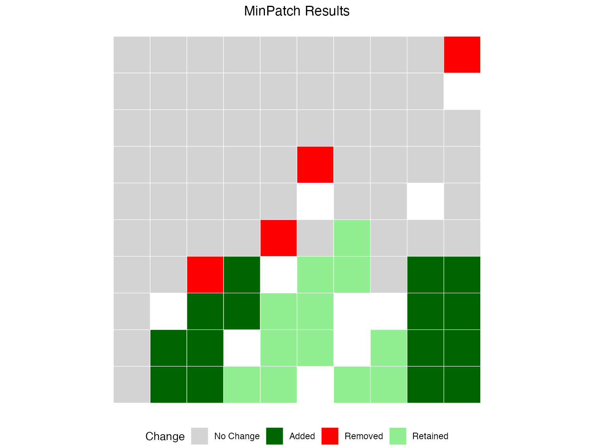

# MinPatch with prioritizr

## Introduction

This vignette demonstrates how to use MinPatch with real conservation
planning data from prioritizr. We’ll use the simulated dataset included
with prioritizr to show a complete workflow from problem formulation
through MinPatch post-processing.

``` r

library(minpatch)
library(prioritizr)
library(sf)
library(terra)
library(dplyr)
library(ggplot2)
library(patchwork)
```

### Step 1: Load and Examine the Data

``` r

dat <- c(get_sim_pu_raster(), get_sim_features()) %>% 
  as.polygons(dissolve = FALSE, values = TRUE) %>%
  sf::st_as_sf() %>% 
  dplyr::rename(cost = layer)

st_crs(dat) <- NA

features = colnames(dat) %>% 
  stringr::str_subset("feature_")
```

### Step 2: Create and Solve a prioritizr Problem

We’ll create a simple minimum set problem with 17% targets for all
features:

``` r

# Create prioritizr problem
p <- problem(dat, features, cost_column = "cost") %>%
  add_min_set_objective() %>%
  add_relative_targets(0.17) %>%  # 17% of each feature
  add_binary_decisions() %>%
  add_default_solver(verbose = FALSE)

# Solve the problem
s <- solve(p)
```

``` r

# plot map of prioritization
plot_prioritizr(s)
```


### Step 3: Run MinPatch

Now we can apply MinPatch directly to the prioritizr objects. The
[`run_minpatch()`](../reference/run_minpatch.md) function automatically
extracts all necessary data from the prioritizr solution object:

``` r

# Calculate reasonable parameters based on planning unit characteristics
median_area <- median(st_area(dat))

# Set minimum patch size to 5x median planning unit area
min_patch_size <- median_area * 5

# Set patch radius to encompass approximately 10 planning units
patch_radius <- sqrt(median_area * 10)

cat("MinPatch parameters:\n")
#> MinPatch parameters:
cat("- Minimum patch size:", round(min_patch_size, 3), "square meters\n")
#> - Minimum patch size: 0.05 square meters
cat("- Patch radius:", round(patch_radius,3), "meters\n")
#> - Patch radius: 0.316 meters
cat("- This means patches must be at least", round(min_patch_size/median_area, 3),
    "times the median planning unit size\n")
#> - This means patches must be at least 5 times the median planning unit size
```

Run MinPatch with automatic data extraction from prioritizr objects

``` r

result <- run_minpatch(
  prioritizr_problem = p,
  prioritizr_solution = s,
  min_patch_size = min_patch_size,
  patch_radius = patch_radius,
  boundary_penalty = 0.001,  # Small boundary penalty for connectivity
  remove_small_patches = TRUE,
  add_patches = TRUE,
  whittle_patches = TRUE,
  verbose = TRUE
)
#> Validating inputs...
#> Initializing data structures...
#> Calculating boundary matrix (optimized version)...
#> Creating patch radius dictionary (optimized)...
#> Calculating initial patch statistics...
#> Stage 1: Removing small patches...
#> Stage 2: Adding new patches...
#>   Initial unmet targets: 5 
#>   Unmet feature IDs: 1, 2, 3, 4, 5 
#>   Iteration 1 - Unmet targets: 5 
#>     Found 85 potential patches with scores
#>     Best score: 0.002280652 for unit 90 
#>     Added patch centered on unit 90 
#>   Iteration 2 - Unmet targets: 2 
#>     Found 74 potential patches with scores
#>     Best score: 0.0009039778 for unit 86 
#>     Added patch centered on unit 86 
#>   All conservation targets are now met!
#> Stage 3: Removing unnecessary planning units...
#>     Edge units found: 27 
#>     Keystone units: 0 
#>     New keystone units: 0 
#>     Scoreable units: 27 
#>     Unit 90 cannot be removed - adding to keystone set
#>     Edge units found: 26 
#>     Keystone units: 1 
#>     New keystone units: 0 
#>     Scoreable units: 26 
#>     Unit 89 cannot be removed - adding to keystone set
#>     Edge units found: 25 
#>     Keystone units: 2 
#>     New keystone units: 0 
#>     Scoreable units: 25 
#>     Unit 81 cannot be removed - adding to keystone set
#>     Edge units found: 24 
#>     Keystone units: 3 
#>     New keystone units: 0 
#>     Scoreable units: 24 
#>     Unit 80 cannot be removed - adding to keystone set
#>     Edge units found: 23 
#>     Keystone units: 4 
#>     New keystone units: 0 
#>     Scoreable units: 23 
#>     Unit 88 cannot be removed - adding to keystone set
#>     Unit 79 cannot be removed - adding to keystone set
#>     Unit 75 cannot be removed - adding to keystone set
#>     Unit 83 cannot be removed - adding to keystone set
#>     Unit 73 cannot be removed - adding to keystone set
#>     Unit 87 cannot be removed - adding to keystone set
#>   No more edge units to consider - terminating
#> Calculating final statistics...
#> MinPatch processing complete!
```

### Step 4: Analyze the Results

Let’s examine what MinPatch accomplished:

``` r

# Print comprehensive summary
print_minpatch_summary(result)
#> === MinPatch Processing Summary ===
#> 
#> Patch Statistics:
#>   Initial patches: 7 (valid: 0)
#>   Final patches: 6 (valid: 2)
#>   Area change: 0.11 (68.7%)
#> 
#> Cost Breakdown:
#>   Planning unit cost: 5353.26
#>   Boundary cost: 0.00
#>   Total cost: 5353.26
#>   Selected units: 27
#> 
#> Feature Representation:
#>   Total features: 5
#>   Targets met: 5
#>   Targets unmet: 0
#>   Mean proportion: 0.304
#>   Total shortfall: 0.00
#> 
#> 
#> === End Summary ===

# Compare original vs MinPatch solutions
comparison <- compare_solutions(result)

# Print overall comparison
cat("=== Overall Solution Comparison ===\n")
#> === Overall Solution Comparison ===
print(comparison$overall)
#>                        Metric   Original   MinPatch Change Percent_Change
#> 1     Selected Planning Units   16.00000   27.00000  11.00       68.75000
#> 2                  Total Area    0.16000    0.27000   0.11       68.75000
#> 3           Number of Patches    7.00000    6.00000  -1.00      -14.28571
#> 4 Valid Patches (>= min size)    0.00000    2.00000   2.00             NA
#> 5           Median Patch Size    0.01000    0.04000   0.03      300.00000
#> 6          Planning Unit Cost 5353.25938 5353.25938   0.00        0.00000
#> 7               Boundary Cost    0.00395    0.00395   0.00        0.00000
#> 8                  Total Cost 5353.26333 5353.26333   0.00        0.00000

# Print feature-level comparison
cat("\n=== Feature-Level Area Comparison ===\n")
#> 
#> === Feature-Level Area Comparison ===
print(comparison$features)
#>   Feature_ID    Target Original_Area MinPatch_Area Area_Change Percent_Change
#> 1          1 12.670220     14.083429     24.037947    9.954517       70.68248
#> 2          2  4.774965      5.124808      7.812367    2.687559       52.44214
#> 3          3 11.029225     11.707674     19.594225    7.886551       67.36224
#> 4          4  6.489033      6.863962     10.995588    4.131626       60.19302
#> 5          5  8.613574      9.482534     16.665588    7.183054       75.75037
#>   Original_Target_Met MinPatch_Target_Met Original_Proportion
#> 1                TRUE                TRUE            1.111538
#> 2                TRUE                TRUE            1.073266
#> 3                TRUE                TRUE            1.061514
#> 4                TRUE                TRUE            1.057779
#> 5                TRUE                TRUE            1.100883
#>   MinPatch_Proportion
#> 1            1.897200
#> 2            1.636110
#> 3            1.776573
#> 4            1.694488
#> 5            1.934805

# Print summary statistics
cat("\n=== Feature Change Summary ===\n")
#> 
#> === Feature Change Summary ===
print(comparison$summary)
#>   features_improved features_reduced features_unchanged targets_gained
#> 1                 5                0                  0              0
#>   targets_lost
#> 1            0

# cat("Features with increased area:", comparison$summary$features_improved, "\n")
# cat("Features with decreased area:", comparison$summary$features_reduced, "\n")
# cat("Features with unchanged area:", comparison$summary$features_unchanged, "\n")
# cat("Targets gained:", comparison$summary$targets_gained, "\n")
# cat("Targets lost:", comparison$summary$targets_lost, "\n")
```

#### Feature Representation Analysis

``` r

# Create solution data for prioritizr analysis
minpatch_solution_data <- result$solution[c("minpatch")]

# Use prioritizr functions for accurate feature representation analysis
feature_rep <- prioritizr::eval_feature_representation_summary(p, minpatch_solution_data)
target_coverage <- prioritizr::eval_target_coverage_summary(p, minpatch_solution_data)

# Summary statistics
targets_met <- sum(target_coverage$met)
mean_achievement <- mean(feature_rep$relative_held, na.rm = TRUE)

cat("Conservation Performance:\n")
#> Conservation Performance:
cat("- Targets met:", targets_met, "out of", nrow(feature_rep), "features\n")
#> - Targets met: 5 out of 5 features
cat("- Mean target achievement:", round(mean_achievement * 100, 1), "%\n")
#> - Mean target achievement: 30.4 %

# Show features with lowest achievement
combined_results <- data.frame(
  feature_id = seq_len(nrow(feature_rep)),
  proportion_met = feature_rep$relative_held,
  target_met = target_coverage$met
)

worst_features <- combined_results[order(combined_results$proportion_met), ][1:5, ]

cat("\nFeatures with lowest target achievement:\n")
#> 
#> Features with lowest target achievement:
print(worst_features)
#>   feature_id proportion_met target_met
#> 2          2      0.2781387       TRUE
#> 4          4      0.2880629       TRUE
#> 3          3      0.3020174       TRUE
#> 1          1      0.3225241       TRUE
#> 5          5      0.3289169       TRUE
```

#### Spatial Configuration Improvements

``` r

initial_stats <- result$patch_stats$initial
final_stats <- result$patch_stats$final

cat("Spatial Configuration Changes:\n")
#> Spatial Configuration Changes:
cat("- Initial patches:", initial_stats$all_patch_count, 
    "(", initial_stats$valid_patch_count, "valid)\n")
#> - Initial patches: 7 ( 0 valid)
cat("- Final patches:", final_stats$all_patch_count, 
    "(", final_stats$valid_patch_count, "valid)\n")
#> - Final patches: 6 ( 2 valid)
cat("- Patch consolidation:", 
    round((1 - final_stats$all_patch_count/initial_stats$all_patch_count) * 100, 1), 
    "% reduction\n")
#> - Patch consolidation: 14.3 % reduction
cat("- Median patch size increase:", 
    round(final_stats$median_all_patch / initial_stats$median_all_patch, 1), "x\n")
#> - Median patch size increase: 4 x
```

### Step 5: Visualize the Results

Let’s create maps to visualize the changes MinPatch made:

``` r

plot_minpatch(result, title = "MinPatch Results")
```



### Understanding the Results

#### Lets check the process

``` r

# First remove small patches
result_remove <- run_minpatch(
  prioritizr_problem = p,
  prioritizr_solution = s,
  min_patch_size = min_patch_size,
  patch_radius = patch_radius,
  remove_small_patches = TRUE,
  add_patches = FALSE,
  whittle_patches = FALSE,
  verbose = FALSE
)
#> Warning in run_minpatch(prioritizr_problem = p, prioritizr_solution = s, :
#> After removing small patches, 5 conservation targets are no longer met.
#> Consider setting add_patches = TRUE to automatically add patches to meet
#> targets, or use a smaller min_patch_size.

# Next add to ensure patches meet minimum size
result_add <- run_minpatch(
  prioritizr_problem = p,
  prioritizr_solution = s,
  min_patch_size = min_patch_size,
  patch_radius = patch_radius,
  remove_small_patches = TRUE,
  add_patches = TRUE,
  whittle_patches = FALSE,
  verbose = FALSE
)

# Finally, try and remove areas without degrading the solution
result_whittle <- run_minpatch(
  prioritizr_problem = p,
  prioritizr_solution = s,
  min_patch_size = min_patch_size,
  patch_radius = patch_radius,
  remove_small_patches = TRUE,
  add_patches = TRUE,
  whittle_patches = TRUE,
  verbose = FALSE
)
```

Plot the comparison

``` r

patchwork::wrap_plots(
  plot_minpatch(result_remove, title = "Remove Small Patches"),
  plot_minpatch(result_add, title = "Add Patches"),
  plot_minpatch(result_whittle, title = "Whittle Planning Units"), 
  guides = "collect",
  ncol = 3
) & theme(legend.position = "bottom")
```


#### What MinPatch Accomplished

1.  **Patch Consolidation**: MinPatch reduced the number of patches by
    removing small, inefficient patches and consolidating the remaining
    areas into larger, more viable patches.

2.  **Size Constraint Satisfaction**: All final patches now meet the
    minimum size threshold, ensuring they are large enough to be
    ecologically viable and cost-effective to manage.

3.  **Target Achievement**: Conservation targets are maintained or
    improved, demonstrating that MinPatch doesn’t compromise
    conservation effectiveness.

4.  **Cost Optimization**: The boundary penalty helps create more
    compact patches, potentially reducing management costs.

#### Key Insights

- **Efficiency vs. Viability Trade-off**: The original prioritizr
  solution was mathematically optimal but contained many small patches.
  MinPatch trades some mathematical optimality for practical viability.

- **Context-Dependent Parameters**: The choice of minimum patch size and
  patch radius should be based on ecological requirements, management
  constraints, and expert knowledge.

- **Computational Considerations**: Processing time scales with the
  number of planning units and the complexity of the spatial
  configuration.

### Best Practices

#### Parameter Selection

1.  **Minimum Patch Size**: Base this on:
    - Ecological requirements (home range sizes, minimum viable
      populations)
    - Management efficiency (minimum economically viable management
      units)
    - Expert knowledge of the study system
2.  **Patch Radius**: Should be:
    - Large enough to allow for elongated patches
    - Not so large as to create unnecessarily large patches
    - Based on typical dispersal distances or management scales
3.  **Boundary Penalty**: Use when:
    - Connectivity between patches is important
    - Compact patches are preferred for management
    - Edge effects are a concern

#### Validation

Always validate your results by:

1.  **Checking target achievement**: Ensure conservation goals are still
    met
2.  **Examining spatial patterns**: Verify that patches make ecological
    sense
3.  **Comparing costs**: Understand the trade-offs involved
4.  **Expert review**: Have domain experts review the final
    configuration

### Advanced Usage

#### Multiple Scenarios

You can run MinPatch with different parameters to explore trade-offs:

``` r

# Conservative scenario (larger patches)
result_conservative <- run_minpatch(
  prioritizr_problem = p,
  prioritizr_solution = s,
  min_patch_size = median_area * 10,  # Larger minimum size
  patch_radius = patch_radius * 1.5,
  boundary_penalty = 0.01,  # Higher boundary penalty
  verbose = FALSE
)

# Compare scenarios
compare_solutions(result_conservative)
#> $overall
#>                        Metric Original MinPatch Change Percent_Change
#> 1     Selected Planning Units   16.000   18.000   2.00       12.50000
#> 2                  Total Area    0.160    0.180   0.02       12.50000
#> 3           Number of Patches    7.000    3.000  -4.00      -57.14286
#> 4 Valid Patches (>= min size)    0.000    0.000   0.00             NA
#> 5           Median Patch Size    0.010    0.070   0.06      600.00000
#> 6          Planning Unit Cost 3535.299 3535.299   0.00        0.00000
#> 7               Boundary Cost    0.023    0.023   0.00        0.00000
#> 8                  Total Cost 3535.322 3535.322   0.00        0.00000
#> 
#> $features
#>   Feature_ID    Target Original_Area MinPatch_Area Area_Change Percent_Change
#> 1          1 12.670220     14.083429     15.583069   1.4996396      10.648256
#> 2          2  4.774965      5.124808      4.827211  -0.2975976      -5.807000
#> 3          3 11.029225     11.707674     12.033291   0.3256171       2.781228
#> 4          4  6.489033      6.863962      8.002595   1.1386334      16.588574
#> 5          5  8.613574      9.482534     11.419918   1.9373846      20.431086
#>   Original_Target_Met MinPatch_Target_Met Original_Proportion
#> 1                TRUE                TRUE            1.111538
#> 2                TRUE                TRUE            1.073266
#> 3                TRUE                TRUE            1.061514
#> 4                TRUE                TRUE            1.057779
#> 5                TRUE                TRUE            1.100883
#>   MinPatch_Proportion
#> 1            1.229897
#> 2            1.010942
#> 3            1.091037
#> 4            1.233249
#> 5            1.325805
#> 
#> $summary
#>   features_improved features_reduced features_unchanged targets_gained
#> 1                 4                1                  0              0
#>   targets_lost
#> 1            0
```

### Conclusion

MinPatch provides a powerful way to post-process prioritizr solutions to
ensure they meet minimum patch size requirements while maintaining
conservation effectiveness. The Tasmania case study demonstrates that
MinPatch can successfully:

- Handle real-world conservation planning datasets
- Consolidate fragmented solutions into viable patch configurations
- Maintain or improve conservation target achievement
- Provide transparent reporting of trade-offs and improvements

By integrating MinPatch into your conservation planning workflow, you
can bridge the gap between mathematically optimal solutions and
practically implementable conservation strategies.

### Session Information

``` r

sessionInfo()
#> R version 4.5.0 (2025-04-11)
#> Platform: aarch64-apple-darwin20
#> Running under: macOS 26.1
#> 
#> Matrix products: default
#> BLAS:   /Library/Frameworks/R.framework/Versions/4.5-arm64/Resources/lib/libRblas.0.dylib 
#> LAPACK: /Library/Frameworks/R.framework/Versions/4.5-arm64/Resources/lib/libRlapack.dylib;  LAPACK version 3.12.1
#> 
#> locale:
#> [1] en_US.UTF-8/en_US.UTF-8/en_US.UTF-8/C/en_US.UTF-8/en_US.UTF-8
#> 
#> time zone: Australia/Sydney
#> tzcode source: internal
#> 
#> attached base packages:
#> [1] stats     graphics  grDevices utils     datasets  methods   base     
#> 
#> other attached packages:
#> [1] patchwork_1.3.2  ggplot2_4.0.0    dplyr_1.1.4      terra_1.8-80    
#> [5] sf_1.0-22        prioritizr_8.1.0 minpatch_0.1.0  
#> 
#> loaded via a namespace (and not attached):
#>  [1] gtable_0.3.6         xfun_0.54            bslib_0.9.0         
#>  [4] raster_3.6-32        htmlwidgets_1.6.4    lattice_0.22-7      
#>  [7] vctrs_0.6.5          tools_4.5.0          generics_0.1.4      
#> [10] parallel_4.5.0       tibble_3.3.0         proxy_0.4-27        
#> [13] pkgconfig_2.0.3      Matrix_1.7-4         KernSmooth_2.23-26  
#> [16] RColorBrewer_1.1-3   S7_0.2.0             desc_1.4.3          
#> [19] assertthat_0.2.1     lifecycle_1.0.4      compiler_4.5.0      
#> [22] farver_2.1.2         stringr_1.6.0        textshaping_1.0.4   
#> [25] codetools_0.2-20     htmltools_0.5.8.1    class_7.3-23        
#> [28] sass_0.4.10          yaml_2.3.10          pillar_1.11.1       
#> [31] pkgdown_2.2.0        exactextractr_0.10.0 jquerylib_0.1.4     
#> [34] rcbc_0.1.0.9003      classInt_0.4-11      cachem_1.1.0        
#> [37] nlme_3.1-168         parallelly_1.45.1    tidyselect_1.2.1    
#> [40] digest_0.6.38        stringi_1.8.7        fastmap_1.2.0       
#> [43] grid_4.5.0           cli_3.6.5            magrittr_2.0.4      
#> [46] dichromat_2.0-0.1    e1071_1.7-16         ape_5.8-1           
#> [49] withr_3.0.2          scales_1.4.0         sp_2.2-0            
#> [52] rmarkdown_2.30       igraph_2.2.1         ragg_1.5.0          
#> [55] evaluate_1.0.5       knitr_1.50           rlang_1.1.6         
#> [58] Rcpp_1.1.0           glue_1.8.0           DBI_1.2.3           
#> [61] rstudioapi_0.17.1    jsonlite_2.0.0       R6_2.6.1            
#> [64] systemfonts_1.3.1    fs_1.6.6             units_1.0-0
```
