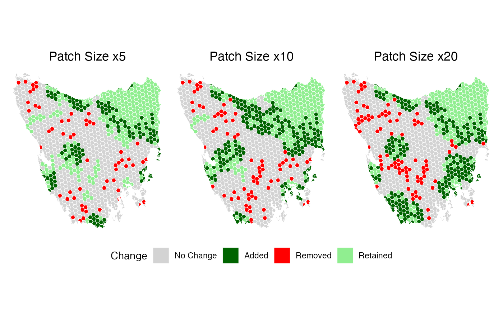

# MinPatch in Tasmania

## Load packages

``` r

library(minpatch)
library(prioritizr)
library(prioritizrdata)
library(terra)
library(sf)
library(ggplot2)
library(dplyr)
```

## Load data

``` r

# load data
tas_pu <- get_tas_pu() %>% 
  mutate(cost = cost*10000)

# At present minpatch works with sf objects. Here we convert the data to sf.
tas_features <- get_tas_features() %>% 
  stars::st_as_stars() %>% 
  sf::st_as_sf()

tas <- sf::st_interpolate_aw(tas_features, tas_pu, extensive = FALSE, keep_NA = FALSE, na.rm = FALSE) %>% 
  st_join(tas_pu, join = st_equals)
#> Warning in st_interpolate_aw.sf(tas_features, tas_pu, extensive = FALSE, :
#> st_interpolate_aw assumes attributes are constant or uniform over areas of x


features = tas %>% 
  sf::st_drop_geometry() %>% 
  dplyr::select(-all_of(c("id", "cost", "locked_in", "locked_out"))) %>% 
  names()

# Convert data to binary again
tas <- tas %>% 
  mutate(across(all_of(features), ~ if_else(.x > 0, 1, 0)))
```

## Run prioritizr analysis

``` r

p <- problem(tas, features = features, cost_column = "cost") %>%
  add_min_set_objective() %>%
  add_relative_targets(0.30) %>%  # 30% of each feature
  add_binary_decisions() %>%
  add_default_solver(verbose = FALSE)

s <- solve(p)
```

### Plot prioritizr solution

``` r

plot_prioritizr(s)
```


## MinPatch

### Choose a patch size

``` r

# Calculate reasonable parameters based on planning unit characteristics
median_area <- median(st_area(tas))

# Set minimum patch size to 5x median planning unit area
min_patch_size <- median_area * 5

# Set patch radius to encompass approximately 10 planning units
patch_radius <- sqrt(median_area * 10)

cat("MinPatch parameters:\n")
#> MinPatch parameters:
cat("- Minimum patch size:", round(min_patch_size, 3), "square meters\n")
#> - Minimum patch size: 324514429 square meters
cat("- Patch radius:", round(patch_radius,3), "meters\n")
#> - Patch radius: 25476.04 meters
cat("- This means patches must be at least", round(min_patch_size/median_area, 3),
    "times the median planning unit size\n")
#> - This means patches must be at least 5 times the median planning unit size
```

### Run minpatch

``` r

result <- run_minpatch(
  prioritizr_problem = p,
  prioritizr_solution = s,
  min_patch_size = min_patch_size,
  patch_radius = patch_radius,
  remove_small_patches = TRUE,
  add_patches = TRUE,
  whittle_patches = TRUE,
  verbose = TRUE
)
#> Validating inputs...
#> Initializing data structures...
#> Calculating boundary matrix using 14 cores...
#> Processing chunks in parallel...
#> Combining results...
#> Creating patch radius dictionary (optimized)...
#> Processed 100 of 1128 planning units
#> Processed 200 of 1128 planning units
#> Processed 300 of 1128 planning units
#> Processed 400 of 1128 planning units
#> Processed 500 of 1128 planning units
#> Processed 600 of 1128 planning units
#> Processed 700 of 1128 planning units
#> Processed 800 of 1128 planning units
#> Processed 900 of 1128 planning units
#> Processed 1000 of 1128 planning units
#> Processed 1100 of 1128 planning units
#> Calculating initial patch statistics...
#> Stage 1: Removing small patches...
#> Stage 2: Adding new patches...
#>   Initial unmet targets: 30 
#>   Unmet feature IDs: 1, 2, 3, 4, 5, 6, 7, 8, 10, 11, 12, 13, 14, 15, 16, 18, 19, 20, 21, 23, 24, 25, 26, 27, 28, 29, 30, 31, 32, 33 
#>   Iteration 1 - Unmet targets: 30 
#>     Found 875 potential patches with scores
#>     Best score: 1.440508e-05 for unit 79 
#>     Added patch centered on unit 79 
#>   Iteration 2 - Unmet targets: 29 
#>     Found 873 potential patches with scores
#>     Best score: 7.880797e-06 for unit 421 
#>     Added patch centered on unit 421 
#>   Iteration 3 - Unmet targets: 27 
#>     Found 864 potential patches with scores
#>     Best score: 5.751114e-06 for unit 387 
#>     Added patch centered on unit 387 
#>   Iteration 4 - Unmet targets: 26 
#>     Found 859 potential patches with scores
#>     Best score: 4.461179e-06 for unit 362 
#>     Added patch centered on unit 362 
#>   Iteration 5 - Unmet targets: 23 
#>     Found 850 potential patches with scores
#>     Best score: 3.090659e-06 for unit 246 
#>     Added patch centered on unit 246 
#>   Iteration 10 - Unmet targets: 17 
#>   All conservation targets are now met!
#> Stage 3: Removing unnecessary planning units...
#>     Edge units found: 427 
#>     Keystone units: 0 
#>     New keystone units: 15 
#>     Scoreable units: 412 
#>     Unit 66 cannot be removed - adding to keystone set
#>     Edge units found: 411 
#>     Keystone units: 16 
#>     New keystone units: 0 
#>     Scoreable units: 411 
#>     Unit 420 cannot be removed - adding to keystone set
#>     Edge units found: 410 
#>     Keystone units: 17 
#>     New keystone units: 0 
#>     Scoreable units: 410 
#>     Unit 246 cannot be removed - adding to keystone set
#>     Edge units found: 409 
#>     Keystone units: 18 
#>     New keystone units: 0 
#>     Scoreable units: 409 
#>     Unit 419 cannot be removed - adding to keystone set
#>     Edge units found: 408 
#>     Keystone units: 19 
#>     New keystone units: 0 
#>     Scoreable units: 408 
#>     Unit 438 cannot be removed - adding to keystone set
#>     Unit 439 cannot be removed - adding to keystone set
#>     Unit 111 cannot be removed - adding to keystone set
#>     Unit 537 cannot be removed - adding to keystone set
#>     Unit 864 cannot be removed - adding to keystone set
#>     Unit 926 cannot be removed - adding to keystone set
#>   Whittling iteration 100 
#>   Whittling iteration 200 
#>   Whittling iteration 300 
#>   Whittling iteration 400 
#>   No more edge units to consider - terminating
#> Calculating final statistics...
#> MinPatch processing complete!
```

### Visualise the minpatch solution

``` r

plot_minpatch(result, title = "MinPatch Results")
```


### Analyse the final results

``` r

print_minpatch_summary(result)
#> === MinPatch Processing Summary ===
#> 
#> Patch Statistics:
#>   Initial patches: 58 (valid: 11)
#>   Final patches: 12 (valid: 11)
#>   Area change: 4378267698.40 (21.8%)
#> 
#> Cost Breakdown:
#>   Planning unit cost: 68792497.20
#>   Boundary cost: 0.00
#>   Total cost: 68792497.20
#>   Selected units: 427
#> 
#> Feature Representation:
#>   Total features: 33
#>   Targets met: 33
#>   Targets unmet: 0
#>   Mean proportion: 0.449
#>   Total shortfall: 0.00
#> 
#> 
#> === End Summary ===

# Compare original vs MinPatch solutions
comparison <- compare_solutions(result)

# Print overall comparison
cat("=== Overall Solution Comparison ===\n")
#> === Overall Solution Comparison ===
print(comparison$overall)
#>                        Metric    Original    MinPatch     Change Percent_Change
#> 1     Selected Planning Units         330         427         97       29.39394
#> 2                  Total Area 20052333083 24430600782 4378267698       21.83421
#> 3           Number of Patches          58          12        -46      -79.31034
#> 4 Valid Patches (>= min size)          11          11          0        0.00000
#> 5           Median Patch Size    64915437   661924221  597008784      919.67152
#> 6          Planning Unit Cost    68792497    68792497          0        0.00000
#> 7               Boundary Cost           0           0          0             NA
#> 8                  Total Cost    68792497    68792497          0        0.00000

# Print feature-level comparison
cat("\n=== Feature-Level Area Comparison ===\n")
#> 
#> === Feature-Level Area Comparison ===
print(comparison$features)
#>    Feature_ID Target Original_Area MinPatch_Area Area_Change Percent_Change
#> 1           1    1.2             2             4           2     100.000000
#> 2           2   33.0            35            39           4      11.428571
#> 3           3    2.7             3             6           3     100.000000
#> 4           4  170.1           177           197          20      11.299435
#> 5           5  213.9           221           260          39      17.647059
#> 6           6  242.1           250           317          67      26.800000
#> 7           7    9.9            12            13           1       8.333333
#> 8           8  108.3           113           137          24      21.238938
#> 9           9   30.9            41            53          12      29.268293
#> 10         10  260.4           271           339          68      25.092251
#> 11         11   62.4            67            82          15      22.388060
#> 12         12  132.0           151           190          39      25.827815
#> 13         13  133.5           138           163          25      18.115942
#> 14         14  122.4           128           137           9       7.031250
#> 15         15   62.4            66            76          10      15.151515
#> 16         16  240.0           246           310          64      26.016260
#> 17         17    0.3             1             1           0       0.000000
#> 18         18   27.6            29            29           0       0.000000
#> 19         19    6.6             8             8           0       0.000000
#> 20         20   18.0            19            25           6      31.578947
#> 21         21   24.3            31            41          10      32.258065
#> 22         22    7.5            12            13           1       8.333333
#> 23         23   34.5            39            54          15      38.461538
#> 24         24   11.1            12            12           0       0.000000
#> 25         25   47.1            51            77          26      50.980392
#> 26         26    9.3            11            11           0       0.000000
#> 27         27   86.7            88           102          14      15.909091
#> 28         28    6.6             7            12           5      71.428571
#> 29         29    1.2             2             2           0       0.000000
#> 30         30  186.0           192           195           3       1.562500
#> 31         31   66.3            71            97          26      36.619718
#> 32         32   30.9            36            49          13      36.111111
#> 33         33   57.9            60            67           7      11.666667
#>    Original_Target_Met MinPatch_Target_Met Original_Proportion
#> 1                 TRUE                TRUE            1.666667
#> 2                 TRUE                TRUE            1.060606
#> 3                 TRUE                TRUE            1.111111
#> 4                 TRUE                TRUE            1.040564
#> 5                 TRUE                TRUE            1.033193
#> 6                 TRUE                TRUE            1.032631
#> 7                 TRUE                TRUE            1.212121
#> 8                 TRUE                TRUE            1.043398
#> 9                 TRUE                TRUE            1.326861
#> 10                TRUE                TRUE            1.040707
#> 11                TRUE                TRUE            1.073718
#> 12                TRUE                TRUE            1.143939
#> 13                TRUE                TRUE            1.033708
#> 14                TRUE                TRUE            1.045752
#> 15                TRUE                TRUE            1.057692
#> 16                TRUE                TRUE            1.025000
#> 17                TRUE                TRUE            3.333333
#> 18                TRUE                TRUE            1.050725
#> 19                TRUE                TRUE            1.212121
#> 20                TRUE                TRUE            1.055556
#> 21                TRUE                TRUE            1.275720
#> 22                TRUE                TRUE            1.600000
#> 23                TRUE                TRUE            1.130435
#> 24                TRUE                TRUE            1.081081
#> 25                TRUE                TRUE            1.082803
#> 26                TRUE                TRUE            1.182796
#> 27                TRUE                TRUE            1.014994
#> 28                TRUE                TRUE            1.060606
#> 29                TRUE                TRUE            1.666667
#> 30                TRUE                TRUE            1.032258
#> 31                TRUE                TRUE            1.070890
#> 32                TRUE                TRUE            1.165049
#> 33                TRUE                TRUE            1.036269
#>    MinPatch_Proportion
#> 1             3.333333
#> 2             1.181818
#> 3             2.222222
#> 4             1.158142
#> 5             1.215521
#> 6             1.309376
#> 7             1.313131
#> 8             1.265005
#> 9             1.715210
#> 10            1.301843
#> 11            1.314103
#> 12            1.439394
#> 13            1.220974
#> 14            1.119281
#> 15            1.217949
#> 16            1.291667
#> 17            3.333333
#> 18            1.050725
#> 19            1.212121
#> 20            1.388889
#> 21            1.687243
#> 22            1.733333
#> 23            1.565217
#> 24            1.081081
#> 25            1.634820
#> 26            1.182796
#> 27            1.176471
#> 28            1.818182
#> 29            1.666667
#> 30            1.048387
#> 31            1.463047
#> 32            1.585761
#> 33            1.157168

# Print summary statistics
cat("\n=== Feature Change Summary ===\n")
#> 
#> === Feature Change Summary ===
print(comparison$summary)
#>   features_improved features_reduced features_unchanged targets_gained
#> 1                27                0                  6              0
#>   targets_lost
#> 1            0
```

## Run different patch sizes

The minimum patch size parameter is the core constraint that drives
MinPatch behaviour - it determines the threshold below which patches are
considered too small and must be either enlarged or removed.

- During Stage 1, MinPatch removes all patches smaller than this
  threshold (except existing protected areas).
- During Stage 2, it adds new patches large enough to meet this minimum
  when targets are unmet.
- During Stage 3 (whittling), it prevents the removal of planning units
  that would make any patch fall below this threshold.

Larger minimum patch sizes result in fewer, bigger patches with
potentially higher total area, as MinPatch must ensure every patch meets
the size requirement. Smaller minimum patch sizes allow more
flexibility, potentially resulting in more patches that are closer to
the original *prioritizr* solution. The choice of minimum patch size
should reflect ecological or management considerations - for example,
larger patches may be needed to support viable populations or reduce
edge effects, while smaller patches may be acceptable in highly
connected landscapes or for features that don’t require large contiguous
areas.

``` r

# Calculate reasonable parameters based on planning unit characteristics
median_area <- median(st_area(tas))
min_patch_size <- median_area * 10
patch_radius <- sqrt(median_area * 10)

result2 <- run_minpatch(
  prioritizr_problem = p,
  prioritizr_solution = s,
  min_patch_size = min_patch_size,
  patch_radius = patch_radius,
  remove_small_patches = TRUE,
  add_patches = TRUE,
  whittle_patches = TRUE,
  verbose = FALSE
)


median_area <- median(st_area(tas))
min_patch_size <- median_area * 20
patch_radius <- sqrt(median_area * 10)

result3 <- run_minpatch(
  prioritizr_problem = p,
  prioritizr_solution = s,
  min_patch_size = min_patch_size,
  patch_radius = patch_radius,
  remove_small_patches = TRUE,
  add_patches = TRUE,
  whittle_patches = TRUE,
  verbose = FALSE
)
```

### Visualise the minpatch solution

``` r

patchwork::wrap_plots(plot_minpatch(result, title = "Patch Size x5"),
                      plot_minpatch(result2, title = "Patch Size x10"),
                      plot_minpatch(result3, title = "Patch Size x20"),
                      guides = "collect",
                      ncol = 3) &
  theme(legend.position = "bottom")
```



## Run different Boundary Penalties

The boundary penalty controls how much MinPatch prioritizes spatial
compactness during the “simulated whittling” stage. During whittling,
MinPatch considers removing planning units from patch edges, but only if
doing so doesn’t increase the total *priortizr* cost. The boundary
penalty affects this decision by penalizing fragmented solutions -
higher penalties favour more compact patches by making it costly to
create additional “edge” between selected and unselected areas. When
MinPatch evaluates whether to remove a unit, it calculates the change in
boundary length (units with selected neighbours increase boundary when
removed, while units with unselected neighbours decrease boundary) and
multiplies this by the boundary penalty. If the resulting boundary cost
change exceeds the unit’s cost, the unit cannot be removed. In datasets
like Tasmania with long planning unit boundaries relative to unit costs,
even small boundary penalties can be highly influential, potentially
preventing most unit removals and resulting in similar solutions across
different penalty values. Very small penalties (e.g., 1e-10) may be
needed to see meaningful differences in such cases.

``` r

# Calculate reasonable parameters based on planning unit characteristics
median_area <- median(st_area(tas))
min_patch_size <- median_area * 5
patch_radius <- sqrt(median_area * 10)

result4 <- run_minpatch(
  prioritizr_problem = p,
  prioritizr_solution = s,
  min_patch_size = min_patch_size,
  patch_radius = patch_radius,
  boundary_penalty = 1e-5,
  remove_small_patches = TRUE,
  add_patches = TRUE,
  whittle_patches = TRUE,
  verbose = FALSE
)


result5 <- run_minpatch(
  prioritizr_problem = p,
  prioritizr_solution = s,
  min_patch_size = min_patch_size,
  patch_radius = patch_radius,
  boundary_penalty = 1e-10, 
  remove_small_patches = TRUE,
  add_patches = TRUE,
  whittle_patches = TRUE,
  verbose = FALSE
)
```

### Visualise the minpatch solution

``` r

patchwork::wrap_plots(plot_minpatch(result, title = "Boundary Penalty: 0"),
                      plot_minpatch(result4, title = "Boundary Penalty: 1e-5"),
                      plot_minpatch(result5, title = "Boundary Penalty: 1e-10"),
                      guides = "collect",
                      ncol = 3) &
  theme(legend.position = "bottom")
```


